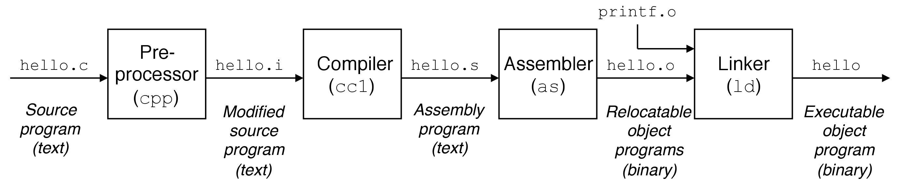

<center>01. C</center>
-----
[TOC]

# 1. 关键字

## 1.1 数据类型关键字（13）
```c
void
char
int short long signed unsigned
float double
enum
struct union
typedef
```

## 1.2 存储类型关键字（4）

```c
auto
register
static
extern
```

## 1.3 控制语句关键字（12）

```c
goto
return
break continue
if else
switch case default
do for while
```

## 1.4 运算符关键字（1）

```c
sizeof
```

## 1.5 其他关键字（2）

```c
const		// 与 volatile 合称“cv特性”，指定变量不可被当前线程/进程改变（但有可能被系统或其他线程/进程改变）。
volatile	// 与 const 合称“cv特性”，指定变量的值有可能会被系统或其他进程/线程改变，强制编译器每次从内存中取得该变量的值。
```

# 2. 运算符

Ｃ语言运算级表：从上至下，优先级依次递减。

|   运算符   |                  运算符                  |    结合性    |
| :--------: | :--------------------------------------: | :----------: |
| 前述运算符 |              ()　[]　->　.               |   从左至右   |
| 单目运算符 |     !　~　++　--　+　-　*　&　sizeof     | ==从右至左== |
| 算术运算符 |                 *　/　%                  |   从左至右   |
| 算术运算符 |                   +　-                   |   从左至右   |
| 移位运算符 |                  <<　>>                  |   从左至右   |
| 关系运算符 |               <　<=　>　>=               |   从左至右   |
| 关系运算符 |                  ==　!=                  |   从左至右   |
| 逻辑运算符 |                    &                     |   从左至右   |
| 逻辑运算符 |                    ^                     |   从左至右   |
| 逻辑运算符 |                    \|                    |   从左至右   |
| 逻辑运算符 |                    &&                    |   从左至右   |
| 逻辑运算符 |                   \|\|                   |   从左至右   |
| 条件运算符 |                   ? :                    | ==从右至左== |
| 赋值运算符 | =　+=　-=　*=　/=　%=　^=　\|=　<<=　>>= | ==从右至左== |
| 逗号运算符 |                    ,                     |   从左至右   |

# 3. 标准库

- **C Standard Library**：**C Standard Library**（libc，C标准函数库）是 C 语言程序设计中，所有匹配标准的头文件的集合，以及常用的函数库实现程序。The **C Standard Library** also called the **IOS C Library**。
- **C POSIX Library**：**C POSIX Library** 是 C 语言的 **POSIX** 系统下的标准库，是 **C Standard Library** 的超集。**POSIX** 指的是 **Portable Operating System Interface**（可移植操作系统接口）。**POSIX** 描述了操作系统的调用服务接口，用于保证编制的应用程序可以在源代码一级上在多种操作系统上移植运行。目前大部分系统都支持 POSIX 接口。下表为 **C POSIX Library** 在不同系统上的具体实现。

|       System       |            Windows             |           GNU/Linux            |    macOS     |
| :----------------: | :----------------------------: | :----------------------------: | :----------: |
| **Implementation** | **Microsoft Run-time Library** | **GNU C Library** or **glibc** | **BSD libc** |

# 4. GCC

GCC 是 GNU Compiler Collection 的缩写，是由 GNU 开发的编程语言编译器，支持 C、C++、Java、Go 等编程语言，`gcc` 和 `g++` 分别是 GCC 用来编译 C、C++ 语言的工具。我们以 `gcc` 为例，分析 C 语言的编译过程，学习 `gcc` 的参数选项。

## 4.1 编译过程



1. **预处理器（Pre-processor）**：预处理器（**cpp**）根据以字符#开头的命令，修改原始的 C 程序，并把相应的内容插入程序文本中。结果就得到了另一个 C 程序，通常是以 `.i` 作为文件扩展名。
2. **编译器（Compiler）**：编译器（**ccl**）将文本文件 `.i` 翻译成文本文件 `.s`，是一个汇编语言程序。
3. **汇编器（Assembler）**：汇编器（**as**）将 `.s` 翻译成机器语言指令，并把这些指令打包成一种叫做**可重定位目标文件（relocatable object file）**的格式，并将结果保存在目标文件 `.o` 中。
4. **链接器（Linker）**：连接器（**ld**）将各种代码和数据片段组合起来，创建一个**可执行目标文件（executable object file）**。

## 4.2 参数选项

使用 `gcc` 时，必须给出一系列必要的参数和文件名称。不同参数的先后顺序对执行结果没有影响，只有在使用同类参数时的先后顺序才需要考虑。

- **基本选项（Basic Options）**：

  ```makefile
  gcc -E hello.c > hello.i	# 进行预处理
  gcc -S hello.c > hello.s	# 进行预处理、编译
  gcc -c hello.c > hello.o	# 进行预处理、编译、汇编，生成可重定位目标文件
  gcc -o hello hello.c		# 指定生成的文件名，用在生成可执行目标文件时
  gcc -x c 					# 指定文件所使用的语言，使后缀名无效
  gcc -x none					# 关闭上一个选型，使后缀名生效
  
  # 控制标准版本的选项
  gcc -ansi					# 指定编译器遵守 ISO C90 标准进行编译
  gcc -std=					# 精准控制使用的标准，例如：c89、c99、gnu99
  ```

- **目录选项（Directory Options）**：

  > These options specify directories to search for header files, for libraries and for parts of the compiler.

  ```makefile
  gcc -Idir	# 将目录 dir 添加到头文件的目录列表中
  gcc -Ldir	# 将目录 dir 添加到库的目录列表中
  ```

- **链接选项（Linker Options）**：

  > These options come into play when the compiler links object files into an executable output file. They are meaningless if the compiler is not doing a link step.

  ```makefile
  gcc -llibrary	# 链接时搜索名为 library 的库，搜索过程见下注解
  gcc -l library	# 这种方法功能与上相同，但仅适用于 POSIX，不建议使用
  ```

  - 搜索过程：例如 `-lm`，则搜索名为 `libm.so` or `libm.a` 的文件。
  - 链接器搜索库的标准目录列表，包括：几个标准系统目录，以及使用 `-L` 指定的任何目录。
  - 静态库是目标文件的归档文件，文件名为 `liblibrary.a`；一些目标文件还支持共享库，文件名为 `liblibrary.so`。如果同时找到静态库和共享库，链接器将优先链接共享库，除非使用 `-static` 选项。

- **警告选项（Warning Options）**：

  > The following language-independent options do not enable specific warnings but control the kinds of diagnostics produced by GCC.

  ```makefile
  gcc -w 		# 禁止所有警告信息
  gcc -Wall 	# 生成所有警告信息
  gcc -Werror # 视警告为错误
  ```

- **调试选项（Debugging Options）**：

  > To tell GCC to emit extra information for use by a debugger, in almost all cases you need only to add `-g` to your other options.

  ```makefile
  gcc -g			# 以操作系统的格式生成调试信息，GDB 可以使用此调试信息
  gcc -ggdb		# 生成供 GDB 使用的调试信息
  gcc -gstabs		# 以 stabs 格式生成调试信息，但不包括 GDB 调试信息
  gcc -gstabs+	# 以 stabs 格式生成调试信息，并且包括 GDB 调试信息
  ```

- **优化选型（Optimization Options）**：

  > These options control various sorts of optimizations.

  ```makefile
  gcc -O0 -O1 -O2 -O3		# 优化等级不同
  ```

[GCC 选项](https://gcc.gnu.org/onlinedocs/gcc/Option-Summary.html)

# 5. Make

## 5.1 pkg-config

`pkg-config` 是编译应用程序和库时使用的辅助工具，可以帮助在命令行中插入正确的编译选项，如下：

```makefile
# 在 gcc 中使用
gcc `pkg-config --cflags --libs opencv4` -o test test.c

# 参数选项
# output all pre-processor and compiler flags
pkg-config --cflags packagename		# 输出所有的预处理和编译器标志，一般是头文件的位置、编译选项

# output all linker flags
pkg-config --libs packagename		# 输出所有链接器标志，一般是库的位置、链接时搜索的库名
```

## 5.2 Make & Makefile

`make` 是一个控制从程序的源文件中生成可执行文件及其他非源文件的工具，通过调用 Makefile 文件中用户指定的命令来进行编译和链接。Makefile 是存放用户将要执行的一系列命令的文件。

### 1. Makefile 的规则

```makefile
target : prerequisites ...
	command
	...
	...
```

- **target**：可以是一个可重定位目标文件，也可以是一个可执行目标文件，还可以是一个标签（label）。
- **prerequisites**：生成该 target 所依赖的文件和/或target。
- **command**：该 target 要执行的命令（任意的 shell 命令）。

### 2. Makefile 的选项

- **CFLAGS**：预处理和编译器标志，一般是头文件的位置、编译选项。
- **LDFLAGS**：链接器标志，一般是库的位置。
- **LIBS**：告诉链接器要链接哪些库文件。

[跟我一起写Makefile](https://seisman.github.io/how-to-write-makefile/introduction.html)

