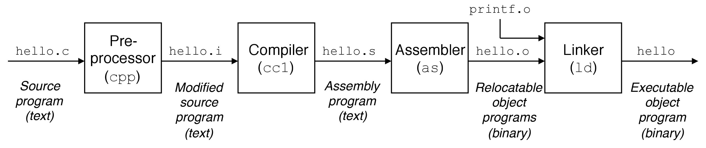

<center>07. 链接(linking)</center>
-----
[TOC]

# 1. 编译器驱动程序

​	在Unix 系统上，从源文件到目标文件的转化是由<font color=red>编译器驱动程序</font>完成的。这个过程可分为四个阶段完成，分别是**预处理器**、**编译器**、**汇编器**、**链接器**，这四个程序一起构成了**编译系统**（compilation system）。



- **预处理器（Pre-processor）**：预处理器（cpp）根据以字符#开头的命令，修改原始的 C 程序，并把相应的内容插入程序文本中。结果就得到了另一个 C 程序，通常是以 `.i` 作为文件扩展名。
- **编译器（Compiler）**：编译器（ccl）将文本文件 `.i` 翻译成文本文件 `.s`，是一个汇编语言程序。
- **汇编器（Assembler）**：汇编器（as）将 `.s` 翻译成机器语言指令，并把这些指令打包成一种叫做**可重定位目标文件（relocatable object file）**的格式，并将结果保存在目标文件 `.o` 中。
- **链接器（Linker）**：连接器（ld）将各种代码和数据片段组合起来，创建一个**可执行目标文件（executable object file）**。

# 2. 目标文件


# 3. 静态链接

## 3.1 可重定位目标文件

## 3.2 符号解析与静态库

## 3.3 重定位

# 4. 动态链接

## 4.1 可执行目标文件

## 4.2 动态链接共享库

## 4.3 位置无关代码

# 5. 库打桩机制

# 6. 处理目标文件的工具
```bash
目标文件：
ar: 创建静态库，插入、删除、列出和提取成员。
objdump: 所有二进制工具之母。能够显示一个目标文件中的所有信息，它最大的作用是反汇编 .text 节中的二进制指令。
readelf: 显示一个目标文件的完整结构，包括elf头中编码的所有信息。包括 size 和 nm 的功能。
nm: 列出一个目标文件的符号表中定义的符号。
size: 列出目标文件中节的名字和大小。
strings: 列出一个目标文件中所有可打印的字符串。
strip: 从目标文件中删除符号表信息。

共享库：
ldd: 列出一个可执行文件在运行时所需要的共享库。
```

