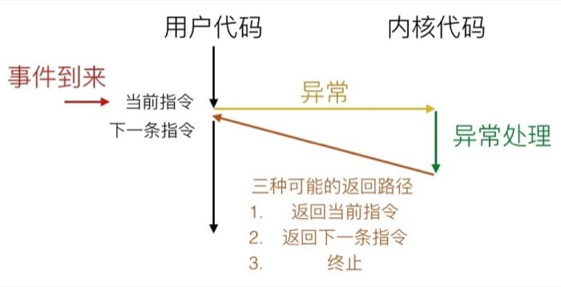
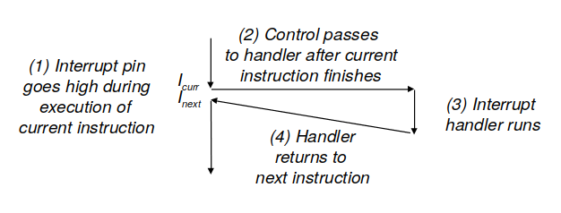
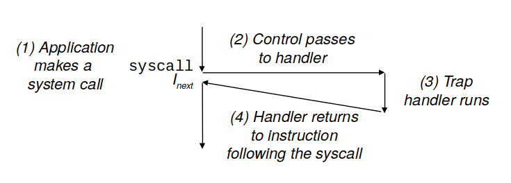
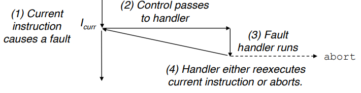
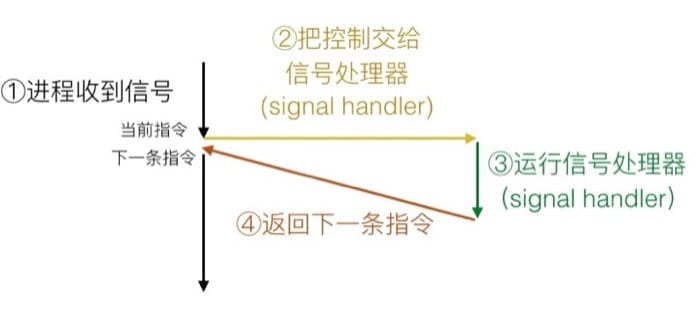
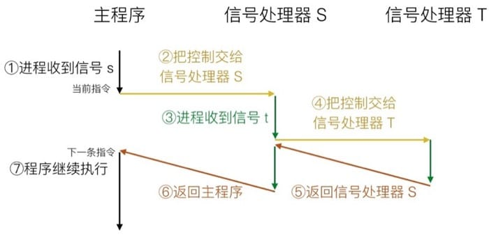

<center>08. 异常控制流(Exceptional Control Flow, ECF)</center>
-----
[TOC]

## 1. 异常控制流

​	从处理器上电到断电为止，程序计数器假设一个值的序列`a0,a1,...,ak,...`，其中，每个`ak`是某个指令`Ik`的地址。每次从`ak`到`ak+1`的过渡称为<font color=red>控制转移</font>。这样的控制转移序列叫做处理器的<font color=red>控制转移</font>。到目前为止，我们已经学过了两种改变控制流的方式：

- 跳转、分支

- 调用、返回

这两种操作对应于程序内部状态变化的反映，没有办法应对更加复杂的系统状态变化，例如：系统状态不是被内部程序变量捕获的、也不一定要和程序的执行相关，如下：

- 一个硬件定时器产生信号

- 包到达网络适配器

- 子进程结束，创造这些子进程的父进程得到通知

​	现代操作系统通过使控制流发生突变来对上述情况作出反应，这些突变，称为<font color=red>异常控制流(Exceptional Control Flow, ECF)</font>。异常控制流发生在计算机系统的各个层次。

- **异常(exception)**：异常位、于硬件和操作系统交界的部分，响应硬件检测到的事件。

- **系统调用**：系统调用是为应用程序提供到操作系统的入口点的异常，<font color=red>属于异常，不属于进程切换</font>。

- **进程切换**：在硬件计时器和操作系统下，内核通过上下文切换将控制从一个用户进程转移到另一个用户进程。

- **信号**：信号位于应用层和操作系统的交界之处。

- **非本地跳转**：ECF 的一种应用层实现形式。

  接下来我们就来分析这四种跨越计算机不同层级的异常控制流机制。

## 2. 异常(Exception)

​	异常是异常控制流的一种形式，它一部分由硬件实现，一部分由操作系统实现。<font color=red>异常</font>就是控制流中的突变，用来响应处理器状态中的某些变化。处理器状态变化称为<font color=red>事件</font>。当事件发生时，处理器会通过一张叫做<font color=red>异常表(exception table)</font>的跳转表，进行一个<font color=red>间接过程调用(异常)</font>，到一个专门设计用来处理这类事件的操作系统子程序，即<font color=red>异常处理程序(exception handler)</font>。具体过程如下图所示：



### 2.1 异常处理

​	系统中为异常分配了一个唯一的非负整数的<font color=red>异常号(exception ber)</font>。异常号主要有两种：

- 处理器设计者分配：例如被零除、缺页、内存访问违例、断点以及算术运算溢出。

- 操作系统内核设计者分配：例如系统调用和来自外部I/O设备的信号。

  <font color=red>异常(间接过程调用)</font>类似于过程调用，但是有一些重要的不同之处：

- 过程调用时，在跳转到处理程序之前，处理器将返回地址压入栈中；异常则是根据其类型，返回地址要么是当前指令，要么是下一条指令或不返回。

- 处理器也把一些额外的处理器状态压入栈里，在处理程序返回时，重新开始执行中断的程序会需要这些状态。

- 如果控制从应用程序转移到内核，所有这些项目都被压到内核栈中，而不是压到用户栈中.

- 异常处理程序运行在<font color=red>内核模式</font>下，对所有的系统资源都有完全的访问权限。

### 2.2 异常的分类

​	异常可以分为四类：中断(interrupt)、陷阱(trap)、故障(fault)、终止(error)。

| 类别 |       原因        | 异步/同步 |       返回行为       |        示例         |
| :--: | :---------------: | :-------: | :------------------: | :-----------------: |
| 中断 | 来自I/O设备的信号 |   异步    | 总是返回到下一条指令 | 计时器中断、I/O中断 |
| 陷阱 |    有意的异常     |   同步    | 总是返回到下一条指令 |   系统调用、断点    |
| 故障 | 潜在可恢复的错误  |   同步    |  可能返回到当前指令  |      缺页异常       |
| 终止 |  不可恢复的错误   |   同步    |       不会返回       |      非法指令       |

​	<font color=red>异步异常</font>称之为中断、硬件中断不是由任何一条专门的指令造成的，从这个意义上说它是异步的；<font color=red>同步异常</font>是执行当前指令的结果，我们把这类指令叫做<font color=red>故障指令(faulting instruction)</font>。

#### 1. 中断

​	中断的异常处理程序称为<font color=red>中断处理程序(interrupt handler)</font>。



<center><font color=red>中断处理(interrupt handling)</font></center>

#### 2. 陷阱和系统调用

​	陷阱是有意的异常，是执行一条指令的结果。就像中断处理程序一样，陷阱处理程序将控制返回到下一条指令。陷阱最重要的用途是在用户程序和内核之间提供一个像过程一样的借口，叫做<font color=red>系统调用</font>。用户程序经常需要向内核请求服务，比如读一个文件(read)、加载一个新的程序(execve)、创建一个新的进程(fork)、或者终止当前进程(exit)，系统提供了一条特殊的`syscall n`指令，执行`syscall`指令会导致一个到异常处理程序的陷阱，这个处理器程序解析参数，并调用适当的内核程序。



<center><font color=red>陷阱处理(trap handling)</font></center>

#### 3. 故障

​	故障由错误情况引起，它能被故障处理程序修正。当故障发生时，转移至故障处理程序。如果能修正这个错误情况，返回故障的指令并重新执行它；否则，返回到内核中的`abort`例程，终止引起故障的应用程序。



<center><font color=red>故障处理(fault handling)</font></center>

​	一个典型的故障示例是缺页异常，当指令引用一个虚拟地址，而与该地址相对应的物理页面不在内存中，因此必须从磁盘中取出时，就会发生故障。然后将相应的页加载成功后，返回故障的指令，正确执行。

#### 4. 终止

​	终止是不可恢复的致命错误造成的成果，处理程序将控制权返回给一个`abort`例程，该例程会终止这个应用程序。

### 2.3 Linux/x86-64 系统中的异常

​	x86-64 系统定义了高达256种不同的异常类型，0～31 号码对应的是由Intel架构师定义的异常，32～255 号码对应的是操作系统定义的中断和陷阱。

#### 1. Linux/x86-64故障和终止

- 除法错误
- 一般保护检查
- 缺页
- 机器检查

#### 2. Linux/x86-64 系统调用

​	系统调用和与它们相关联的包装函数都称为<font color=red>系统级函数</font>。所有到 Linux 系统调用的参数都是通过通用寄存器而不是栈传递的。

## 3. 进程(process)

​	<font color=red>进程(process)</font>的经典定义就是<font color=red>一个执行中程序的实例</font>。系统中的每个程序都运行在某个进程的<font color=red>上下文</font>中。上下文是由程序正确运行所需的状态组成的。这个状态包括存放在内存中的程序的代码和数据、它的栈、通用目的寄存器的内容、程序计数器、环境变量以及文件描述符的集和(正好符合进程是处理器、主存及 I/O 设备的抽象)。进程提供给应用程序两个非常关键的抽象：

- 一个独立的逻辑控制流：它提供一个假象，好像我们的程序独占地使用处理器。
- 一个私有的地址空间：它提供一个假象，好像我们的程序独占地使用内存系统。

### 3.1 逻辑控制流

​	<font color=red>程序计数器(PC)</font>的值唯一地对应于包含在程序的可执行目标文件中的指令，或者是包含在运行时动态链接到程序的共享对象中的指令，PC值的序列叫做<font color=red>逻辑控制流</font>，简称逻辑流。进程轮流使用处理器， 每个进程执行它的流的一部分，然后被<font color=red>抢占(preempted)</font>(暂时挂起)，然后轮到其他进程。对于一个运行在这些进程之一的上下文中的程序，它看上去就像是在独占地使用处理器。

### 3.2 并发流

​	一个逻辑流的执行在时间上与另一个流重叠，称为<font color=red>并发流(concurrent flow)</font>，这两个流被称为<font color=red>并发地运行</font>，准确的说是两个流互相并发，多个流并发地执行的一般现象被称为<font color=red>并发(concurrency)</font>。如果两个流并发地运行在不同的处理器核或者计算机上，那么我们称它们为<font color=red>并行流(parallel flow)</font>，它们<font color=red>并行地运行(running in parallel)</font>，且<font color=red>并行地执行(parallel execution)</font>。（运行 和 执行 不一样，并发流称之为运行，并行流称之为执行）

### 3.3 私有地址空间

​	进程为每个程序提供它自己的私有地址空间。

### 3.4 用户模式和内核模式

​	处理器通常是用某个控制寄存器中的一个<font color=red>模式位(mode bit)</font>来提供这种功能的，该寄存器描述了进程当前享有的特权。当设置了模式位时，进程就运行在<font color=red>内核模式</font>中；没有设置模式位时，进程就运行在<font color=red>用户模式</font>中。

- 内核模式：可以执行指令集中的任何指令，可以访问系统中的任何内存位置。

- 用户模式：不允许执行特权指令，不允许直接引用地址空间中内核内的代码和数据（通过系统调用可以）

进程从用户模式变为内核模式的唯一方法使通过中断、故障或者陷入系统调用这样的异常。

### 3.5 上下文切换

​	操作系统内核使用一种称为上下文切换的较高层形式的异常控制流来实现多任务。内核为每个进程维持一个上下文。内核调度新进程，并使用一种称为上下文切换的机制来将控制权转移到新的进程。上下文切换：

1. 保存当前进程的上下文；

2. 恢复某个先前被抢占的进程被保存的上下文；

3. 将控制传递给这个新恢复的进程。

当内核代表用户执行系统调用时，可能会发生上下文切换；中断也可能引发上下文切换。

## 4. 进程控制

​	每个进程都有一个唯一的正数进程 ID (PID)。进程总处于下面三种状态之一：

- 运行：进程要么在 CPU 上执行，要么在等待执行且最终会被内核调度。

- 停止：进程的执行被挂起，且不会被调度。当收到 SIGSTOP、SIGTSTP、SIGTTIN 或者 SIGTTOU 信号时，进程就停止，并且保持停止直到它收到一个 SIGCONT 信号，在这个时刻，进程再次开始运行。

- 终止：进程永远的停止了。进程会因为三种原因终止：1）收到一个信号，该信号的默认行为是终止进程；2）从主程序返回；3）调用 exit() 函数。

父进程与子进程具有相同但独立的地址空间，包括代码和数据段、堆、共享库和用户栈，子进程还获得与父进程任何打开文件描述符相同的副本；最大的区别在于它们有不同的 PID。

```c
#include <unistd.h>

/* 获取进程 ID */
pid_t getpid(void);		/* 返回调用进程的 PID */
pid_t getppid(void);	/* 返回父进程的 PID */

/* 创建进程：父进程调用 fork() 函数创建一个新的运行的子进程 */
pid_t fork(void);		/* 返回：子进程返回 0；父进程返回子进程 PID，出错为 -1； */
/* 终止进程 */
void exit(int status);

/* 回收子进程：父进程调用 waitpid() 函数等待它的子进程停止或终止 */
pid_t waitpid(pid_t pid, int *statusp, int options);
pid_t wait(int *statusp);

/* 挂起进程 */
unsigned int sleep(unsigned int secs);	/* 将一个进程挂起一段指定的时间 */
int pasue(void);		/* 使该进程休眠，直到该进程收到一个信号 */

/* 加载并执行程序 */
/* execve: 调用一次从不返回，除非未找到 filename */
int execve(const char *filename, const char *argv[], const char *envp[]);
```

​	进程 VS 程序：进程是执行中程序的一个具体的实例；程序总是运行在某个进程的上下文中。fork() 函数在新的子进程中运行相同的程序，新的子进程是父进程的一个复制品。execve() 函数是在当前进程的上下文中加载并执行一个新的程序，它会覆盖当前进程的地址空间，但没有创建新的进程，并且继承了相同的文件描述符。

## 5. 信号(signal)

​	<font color=red>信号</font>是一种更高层次的软件形式的异常，它允许进程和内核中断其他进程，每种信号类型都对应于某种系统事件，Linux 系统支持 30 种不同类型的信号。低层的硬件异常是由内核异常处理程序处理的，正常情况下，对用户进程不可见。信号提供一种机制，通知用户进程发生了这些异常。

### 5.1 信号术语

​	传送一个信号到目的进程是由两个不同步骤组成的：

- <font color=red>发送信号</font>：内核通过更新目的进程的上下文中的某个状态，发送一个信号给目的进程。发送信号可以有如下两种原因：1）内核检测到一个系统事件；2）一个进程调用了 kill() 函数，显式地要求内核发送一个信号给目的进程。一个进程可以发送信号给它自己。
- <font color=red>接收信号</font>：当目的进程被内核强迫以某种方式对信号的发送做出反映时，它就接受了信号。进程可以忽略这个信号，终止或者执行一个称为<font color=red>信号处理程序(signal handler)</font>的==用户层函数==捕获这个信号。



​	一个发出而没有被接受的信号叫做<font color=red>待处理信号(pending signal)</font>。一种类型至多只会有一个待处理信号，如果一个进程有一个类型为 *k* 的待处理信号，那么任何接下来发送到这个进程的类型为 *k* 的信号都不会排队等待，只是被简单的丢弃。

​	进程可以有选择性地<font color=red>阻塞</font>接收某种信号。当一种信号被阻塞时，它仍可以被简单地丢弃，但是产生的待处理信号不会被接收，直到进程取消对这种信号的阻塞。内核用<font color=red>等待(pending)</font>位向量和<font color=red>阻塞(blocked)</font>位向量来维护每个进程的信号相关状态。

### 5.2 发送信号

​	Unix 系统提供了大量向进程发送信号的机制，这些机制都是基于<font color=red>进程组(process group)</font>这个概念的。

#### 1. 进程组

​	每个进程都只属于一个进程组，进程组是由一个正整数进程组 ID 来标识的。默认地，一个子进程和它的父进程同属于一个进程组。

```c
#include <unistd.h>

pid_t getpgrp(void);	/* 返回当前进程的进程组ID */

int setpgid(pid_t pid, pid_t pgid);	/* 改变自己或者其他进程的进程组 */
```

#### 2. 用 `kill` 程序发送信号


```bash
kill -9 15213	# 发送信号 9-SIGKILL 给进程 15213
kill -9 -15213	# 发送信号 9-SIGKILL 给进程组 15213 中的每一个进程
```

#### 3. 从键盘发送信号

​	Unix shell 使用<font color=red>作业(job)</font>这个抽象概念来表示对一条命令行求值而创建的进程，在任何时刻，至多只有一个前台作业和 0 个或多个后台作业。shell 为每个作业创建一个独立的进程组，进程组 ID 通常取自作业中父进程中的一个。在键盘上输入 `Ctrl+C`会导致内核发送一个 SIGINT 信号到前台进程组中的每个进程。

#### 4. 用函数发送信号

```c
#include <sys/types.h>
#include <signal.h>

/* kill 函数发送信号给其他进程(包括它自己) */
int kill(pid_t pid, int sig);

/* alarm 函数安排内核在 secs 秒后发送一个 SIGALRM 信号给调用进程 */
unsigned int alarm(unsigned int secs);
```

### 5.3 接收信号

​	当内核把进程 *p* 从内核模式切换到用户模式时，它会检查进程 *p* 的未被阻塞的待处理信号的集合<font color=red>(pending & ~blocked)</font>。如果这个集合为空，那么内核将控制传递到 *p* 的逻辑控制流的下一条指令 *I~next~*；如果集合非空，那么内核选择集合中的某个信号 *k* (通常是最小的 *k* )，并且强制 *p* <font color=red>接受</font>信号 *k*。接收信号会触发进程采取某种行为，一旦进程完成了该行为，那么控制就传递回 *p* 的逻辑控制流的下一条指令 *I~next~*；每个信号类型都有一个默认行为：

- 进程终止

- 进程终止并转储内存

- 进程停止直到被 SIGCONT 信号重启

- 进程忽略该信号

进程可以通过 `signal` 函数修改和信号相关联的默认行为（信号 SIGSTOP 和 SIGKILL 默认行为不可更改）。

```c
#include <signal.h>
typedef void (*sighandler_t)(int);

sighandler_t signal(int signum, sighandler_t handler);
```

`signal` 函数可以通过下列三种方法之一来改变和信号 `signum` 相关联的行为：

- 如果 `handler` 是 SIG_IGN，那么忽略类型为 `signum` 的信号。

- 如果 `handler` 是 SIG_DFL，那么类型为 `signum` 的信号恢复为默认行为。

- 否则，`handler` 就是用户定义的函数的地址，这个函数称为<font color=red>信号处理程序</font>。通过把处理程序的地址传入到`signal` 函数从而改变默认行为，这叫做<font color=red>设置信号处理程序(installing the handler)</font>。调用信号处理程序被称为<font color=red>捕获信号</font>；执行信号处理程序被称为<font color=red>处理信号</font>。

当处理程序执行它的 `return` 语句时，控制（通常）传递回控制流中进程被信号接受中断位置出的指令。信号处理程序可以被其他信号处理程序中断<font color=red>(s != t)</font>（不同类型的信号可中断，相同类型的信号只会处理一个、阻塞一个，其余的就被简单的抛弃。）。



### 5.4 阻塞和解除阻塞信号

Linux 提供阻塞信号的隐式和显示的机制：

- <font color=red>隐式阻塞机制</font>：内核默认阻塞与当前处理程序正在处理的信号类型相同的待处理信号。例如上图，若 *t = s*，则*信号处理程序 S* 不会被中断，但 *t* 会被添加到待处理信号集合中，等 *S* 结束后，会处理信号 *t*。

- <font color=red>显式阻塞机制</font>：应用程序可以使用 `sigprocmask` 函数和它的辅助函数，明确地阻塞和解除阻塞选定的信号。

```c
#include <signal.h>

int sigprocmask(int how, const sigset_t *set, sigset_t *oldset);
int sigemptyset(sigset_t *set);
int sigfillset(sigset_t *set);
int sigaddset(sigset_t *set, int signum);
int sigdelset(sigset_t *set, int signum);

int sigismember(const sigset_t *set, int signum);
```

### 5.5 编写信号处理程序

​	信号处理是 Linux 系统编程最棘手的问题，主要有如下几个方面：

1. ==处理程序与主程序并发执行==，共享同样的全局变量，因此可能与主程序和其他处理程序相互干扰；
2. 如何以及何时接收信号的规则常常有违人的直觉；
3. 不同的系统有不同的信号处理语义。

#### 1. 安全的信号处理

- 处理程序要尽可能简单：处理程序只是简单地设置全局标志并立即返回；
- 处理程序中只调用异步信号安全的函数：异步信号安全函数要么可重入的、要么不能被信号处理程序中断；
- 保存和恢复 `errno` ：在进入和退出的时候保存和恢复 `errno` ；
- 阻塞所有信号，保护对全局数据结构的访问：
- 用 `volatile` 声明全局变量：强迫从内存中读该变量值，保护对全局变量的访问；
- 用 `sig_atomic_t` 声明标志：安全读写，`volatile sig_atomic_t flag` 。

#### 2. 正确的信号处理

​	信号的一个与直觉不符的方面是未处理的信号是不排队的。关键思想是如果存在一个未处理的信号就表明至少有一个信号到达了。不可以用信号对其他进程中发生的事件计数。

#### 3. 可移植的信号处理

​	Unix 信号处理的另一个缺陷在于不同的系统有不同的信号处理语意。

- `signal` h函数的语意各有不同。
- 系统调用可以被中断。

#### 4. 同步流以避免讨厌的并发错误

​	如何编写读写相同存储位置的并发流程序的问题，困扰着数代计算机科学家。基本的问题是以莫中方式同步并发流，从而得到最大的可行的交错的集合，每个可行的交错都能得到正确的结果。<font color=red>竞争(race)</font>是一个经典的同步错误。

## 6. 非本地跳转

​	C 语言提供了一种用户级异常控制流 形式，称为<font color=red>非本地跳转(nonlocal jump)</font>，它将控制直接从一个程序转移到另一个当前正在执行的函数，而不需要经过正常的调用—返回序列。非本地跳转是通过 `setjmp` 和 `longjmp` 函数来提供的。

```c
#include <signal.h>

int setjmp(jmp_buf env);
int sigsetjmp(sigjmp_buf env, int savesigs);	/* 可被信号处理程序使用的版本 */

void longjmp(jmp_buf env, int retval);			
void siglongjmp(jmp_buf env, int retval);		/* 可被信号处理程序使用的版本 */
```

​	`setjmp` 函数被调用一次，但返回多次：一次是当第一次调用 `setjmp`，调用环境保存在缓冲区 `env` 中，返回零；一次是为每个相应的 `longjmp` 调用。另一方面，`longjmp` 函数被调用一次，但从不返回。

## 7. 操作系统的工具

Linux 系统提供了大量的监控和操作进程的有用工具。

```bash
strace: 打印一个正在运行的程序和她的子进程调用的每个系统调用的轨迹。
ps: 列出当前系统的进程（包括僵尸进程）。
top: 打印出关于当前进程资源使用的信息。
pmap: 现实进程的内存映射。

/proc: 一个虚拟文件系统，以 ASCII 文本格式输出大量内核数据结构的内容，用户程序可以读取这些内容。
```

