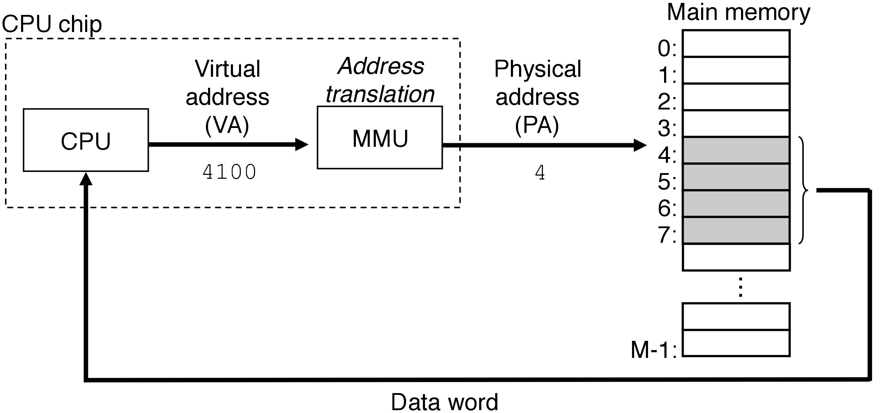

09. 虚拟内存(Virtual Memory, VM)

-----
[TOC]

# 1. 虚拟内存

​	虚拟内存(Virtual Memory, VM)是硬件异常、硬件地址翻译、主存、磁盘文件和内核软件的完美交互，它为每个进程提供了一个大的、一致的和私有的地址空间。虚拟内存提供了三个重要的能力：

- 它将主存看成是一个存储在磁盘上的地址空间的高速缓存，在主存中只保存活动区域，并根据需要在磁盘和主存之间来回传送数据，通过这种模式，它高效地使用了主存。

- 它为每个进程提供了一致的地址空间，从而简化了内存管理。

- 它保护了每个进程的地址空间不被其他进程破坏。

虚拟内存是计算机系统最重要的概念之一，它成功的一个主要原因就是因为它是沉默地、自动地工作。

- 虚拟内存是核心的：虚拟内存遍及计算机系统的所有层面。

- 虚拟内存是强大的：虚拟内存给予应用程序强大的能力，可以创建和销毁内存片(chunk)、将内存片映射到磁盘文件的某个部分，以及与其他进程共享内存。

- 虚拟内存是危险的：每次应用程序引用一个变量、间接引用一个指针，或者调用一个诸如 `malloc` 这样的动态分配程序时，它就会和虚拟内存发生交互。

# 2. 从物理内存到虚拟内存

CPU 访问内存有两种方式：

- 物理寻址：CPU 访问内存直接使用物理地址(Physical Address, PA)进行寻址。

- 虚拟寻址：CPU 通过生成一个虚拟地址(Virtual Address, VA)来访问主存，这个虚拟地址在被送到内存之前先转换成适当的物理地址。如下图所示：

​	将一个虚拟地址转换为物理地址的任务叫做地址翻译(address translation)。CPU 芯片上叫做内存管理单元(Memory Management Unit, MMU)的专用硬件，利用存放在主存中的查找表来动态的翻译虚拟地址，该表的内容由操作系统管理。

地址空间：地址空间(address apace)是一个非负整数地址的有序集合。此外，一个系统还有一个*虚拟地址空间*和*物理地址空间*。

# 3. 虚拟内存的三个角色

## 3.1 虚拟内存作为缓存的工具

