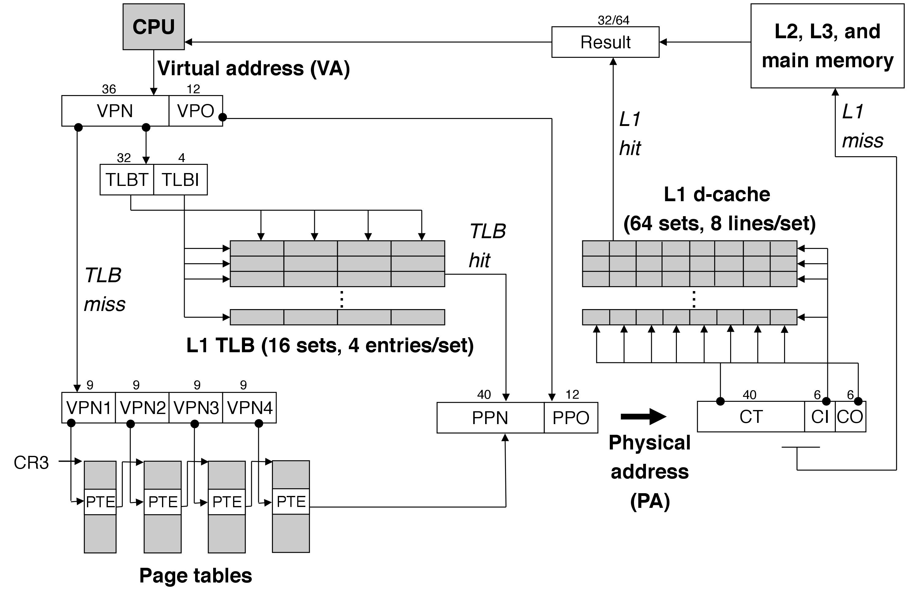

09. 虚拟内存(Virtual Memory, VM)

-----
[TOC]

# 1. 虚拟内存

​	虚拟内存(Virtual Memory, VM)是硬件异常、硬件地址翻译、主存、磁盘文件和内核软件的完美交互，它为每个进程提供了一个大的、一致的和私有的地址空间。虚拟内存提供了三个重要的能力：

- ==它将主存看成是一个存储在磁盘上的地址空间的高速缓存==，在主存中只保存活动区域，并根据需要在磁盘和主存之间来回传送数据，通过这种模式，它高效地使用了主存。

- 它为每个进程提供了一致的地址空间，从而简化了内存管理。

- 它保护了每个进程的地址空间不被其他进程破坏。

虚拟内存是计算机系统最重要的概念之一，它成功的一个主要原因就是因为它是沉默地、自动地工作（虚拟内存类似于指令集，即指令集是 CPU 本身；虚拟内存是 CPU 和 MMU 组合工作的集合，将虚拟内存转成物理内存的过程就是虚拟内存的重要性）。

- 虚拟内存是核心的：虚拟内存遍及计算机系统的所有层面。

- 虚拟内存是强大的：虚拟内存给予应用程序强大的能力，可以创建和销毁内存片(chunk)、将内存片映射到磁盘文件的某个部分，以及与其他进程共享内存。

- 虚拟内存是危险的：每次应用程序引用一个变量、间接引用一个指针，或者调用一个诸如 `malloc` 这样的动态分配程序时，它就会和虚拟内存发生交互。

# 2. 从物理内存到虚拟内存

CPU 访问内存有两种方式：

- 物理寻址：CPU 访问内存直接使用物理地址(Physical Address, PA)进行寻址。

- 虚拟寻址：CPU 通过生成一个虚拟地址(Virtual Address, VA)来访问主存，这个虚拟地址在被送到内存之前先转换成适当的物理地址。如下图所示：

​	将一个虚拟地址转换为物理地址的任务叫做地址翻译(address translation)。CPU 芯片上叫做内存管理单元(Memory Management Unit, MMU)的专用硬件，利用存放在主存中的查找表来动态的翻译虚拟地址，该表的内容由操作系统管理。

地址空间：地址空间(address apace)是一个非负整数地址的有序集合。此外，一个系统还有一个*虚拟地址空间*和*物理地址空间*。

# 3. 虚拟内存的三个角色

## 3.1 虚拟内存作为缓存的工具

### 1. 页面

​	概念上而言，虚拟内存被组织为一个由==存放在磁盘==上的 *N* 个连续字节的数组。每字节都有一个唯一的虚拟地址，作为到数组的索引；磁盘上数组的内容缓存在主存中。虚拟内存系统通过将虚拟内存分割为称为虚拟页(Virtual Page, VP)的大小固定的块来处理这个问题。每个虚拟页的大小为 *P = 2^p^* 字节。 类似的，物理内存被分割为物理页(Physical Page, PP)，大小也为 *P* 字节。在任意时刻，虚拟页面都只有以下三种状态：

- 未分配的：虚拟内存系统还未分配页。
- 缓存的：当前缓存在物理内存中的已分配页。
- 未缓存的：未缓存在物理内存中的已分配页

​	*DRAM 缓存*作为虚拟内存系统的缓存，它在主存中缓存虚拟页。由于 *DRAM 缓存*的组织结果完全是由巨大的不命中开销驱动的，所以我们的目标就是尽可能从 DRAM 中取数据。为此，我们需要：

- 更大的页尺寸：通常是 4KB～2MB
- 全相连：任何虚拟页都可以放置在任何物理页中
- 更复杂精密的替换算法
- DRAM 缓存总是使用写回，而不是直写

### 2. 页表

​	页表(page table)是==存储在物理内存==中的数组，一个由页表条目(Page Table Entry, PTE)组成的数组，其索引称为页表条目地址(PTEA)。我们假设每个 PTE 是由一个*有效位*和 *n* 位地址字段组成：

- 设置有效位表示物理页缓存了该虚拟页，地址字段表示相应的物理页地址；（对应于虚拟页面 缓存的）

- 未设置有效位，若有地址字段，表示该虚拟页在磁盘上的起始位置；（对应于虚拟页面 未缓存的）

- 未设置有效位，若空地址，表示该虚拟页未分配；（对应于虚拟页面 未分配的）

因为有页表可查，就会遇到三种情况：页命中(page hit)、缺页(page fault)、分配页面。

命中的时候，即访问页表中蓝色条目的地址，因为在 DRAM 中有对应的数据，可以直接访问。

不命中的时候，即访问页表中灰色条目的时候，因为 DRAM 中没有对应的数据，会触发一个==缺页异常==，调用内核中的缺页异常处理程序，完成之后重新执行访问指令，这是就会变成页命中。

分配页面时，就是在磁盘上创建空间并更新 PTE，使它指向磁盘上这个新创建的页面，但不会复制到 DRAM，只有当出现缺页时才拷贝数据。

## 3.2 虚拟内存作为内存管理的工具

​	操作系统为每个进程提供了==一个独立的页表==，按需页面调度和独立的虚拟地址空间的结合，对系统中内存的利用和管理造成了深远的影响。特别地，*VM* 简化了链接和加载、代码和数据共享，以及应用程序的内存分配。

- 简化链接：独立的地址空间允许每个进程的内存映像使用相同的基本格式，而不管代码和数据实际存放在物理内存的何处。可执行文件是独立于物理内存中代码和数据的最终位置的。

- 简化加载：Linux 加载器为代码和数据段分配虚拟页，把他们分配为==未缓存的==，将页表条目指向目标文件中适当的位置（页表条目指向的是磁盘地址）。加载器从不从磁盘到内存实际复制任何数据，只有当引用发生缺页异常时才会自动的调入数据页。

- 简化共享：共享页面。

- 简化内存分配：即 `malloc` 内存分配，需要 *k* 个连续的虚拟内存页面时；物理内存页面不需要提供 *k* 个连续的物理内存页面

内存映射(memory mapping)：将一组连续的虚拟页映射到任意一个文件中的任意位置的表示法称作*内存映射*。

## 3.3 虚拟内存作为内存保护的工具

​	现代操作系统需要提供手段来控制对内存系统的访问，由于每次 CPU 生成一个地址时，MMU 都会读一个PTE，所以我们可以在 PTE 上添加一些额外的许可位来控制读一个虚拟页面内存的访问，如下图所示：

# 4. 地址翻译

## 4.1 VA、PA、TLB、多级页表

开始之前先来了解一下参数：
$$
N=2^n, M=2^m, P=2^p
$$
其中 `N` 表示虚拟地址空间中的地址数量，`M` 表示物理地址空间中的地址数量，`P`  表示页的大小(字节)。

虚拟地址(Virtual Address, VA)的组成部分：
$$
VA=VPN+VPO=TLBT+TLBI+VPO
$$

- `VPN`：虚拟页号
- `VPO`：虚拟页面偏移量
- `TLBT`：TLB 标记
- `TLBI`：TLB 索引

物理地址(Physical Address, PA)的组成部分：
$$
PA=PPN+PPO=CT+CI+CO
$$

- `PPN`：物理页号
- `PPO`：物理页面偏移量
- `CT`：高速缓存标记
- `CI`：高速缓存索引
- `CO`：缓存块内的字节偏移量

页表基址寄存器(Page Table Base Register, PTBR)：CPU 中的一个控制寄存器，指向当前页表的基地址。由于操作系统为每一个进程都维护了一个独立的页表，每个页表都要有一个基地址；则对于一个进程，页表基址寄存器就显得极为重要，没有它，就没法确定当前进程的页面位置。

翻译后备缓冲器(Translation Lookaside Buffer, TLB)：TLB 可以被认为是页表在 MMU 中的缓存了；TLB 是一个小的、虚拟寻址的缓存，其中每一行都保存着一个由单个 PTE 组成的块。为了解决每次 CPU 产生一个虚拟地址，MMU 就必须查阅一个 PTE 的问题。

多级页表(Multi-Level Page Table, MLPT)：下图描述了使用 *k* 级页表层次结果的地址翻译。虚拟地址被划分为 *k* 个 VPN 和 *1* 个 VPO。每个 VPN *i* 都是一个到第 *i* 级页表的索引；第 *j* 级页表中的每个 PTE 都是指向第 *j+1* 级的某个页表的基地址。

## 4.2 Intel Core i7 地址翻译实例

Intel Core i7 支持 48 位虚拟地址空间和 52 位物理地址空间。

## 4.3 Linux 虚拟内存系统

​	Linux 通过虚拟内存系统管理进程，为每个进程维护了一个单独的虚拟地址空间；硬件上，通过 MMU 将虚拟内存转成物理内存；内核上，通过内核虚拟内存对进程的虚拟内存管理。Linux 为每个进程维护的单独虚拟地址空间如下所示：

一个 Linux 进程的虚拟内存：

- 内核虚拟内存：
  - 进程相关的数据结构：页表、内核在进程的上下文中执行代码时所用的栈、记录==当前虚拟地址空间当前组织的各种数据结构==。
  - 物理内存：Linux 将一组连续的虚拟页面（大小等于 DRAM 总量）映射到一组连续的物理页面，这就为内核提供了一种便利的方法来访问物理内存中的任何位置。
  - 内核代码和数据：kernel code and data
- 进程虚拟内存:

  - 用户栈：user stack
  - 共享库的内存映射区域：memory mapped region for shared libraries
  - 运行时堆：runtime heap
  - 未初始化数据：.bss
  - 已初始化数据：.data
  - 代码：code

# 5. 动态内存分配

​	程序员通过动态内存分配来让程序在运行时的得到虚拟内存。动态内存分配器(dynamic memory allocator)维护着一个进程的虚拟内存区域，简称堆(heap)。分配器将堆视为一组不同大小的==块(block)==的集合，要么是*已分配的*，要么是*空闲的*。有两种类型的分配器：

- 显示分配器：要求应用显示地释放任何已分配的块(c 语言中的 `malloc` 和 `free`)

- 隐式分配器：分配器检测一个已分配块何时不再被程序所使用并释放这个块

## 5.1 性能指标

显示分配其必须在一些严格的约束条件下工作：

- 处理任意请求序列

- 立即响应请求

- 只使用堆

- 对其块

- 不修改已分配的块

在这些条件上，需要实现以下两个目标，而这两个目标通常情况下是互相冲突的：

- 最大化吞吐率

- 最大化内存利用率

造成堆利用率很低的主要原因是一种称为碎片(fragmentation)的现象。

- 内部碎片：是已分配块大小和它们的有效载荷大小只差的和。例如：维护堆的数据结构和块对齐的冗余。内部碎片的数量只取决于以前请求的模式和分配器的实现方式。
- 外部碎片：是当空闲内存合计起来足够满足一个分配请求，但是没有一个单独的空闲块足够大可以来处理这个请求时发生的。外部碎片不仅取决于以前请求的模式和分配器的实现方式，还取决于将来请求的模式。

## 5.2 实现细节

实现内存分配需要注意的问题：1. 空闲块组织；2. 放置；3. 分割；4. 合并。方法：

- 隐式空闲链表

- 显式空闲链表

- 分离的空闲链表

# 6. 垃圾收集

​	垃圾收集器是一种动态内存分配器(garbage collector)，它自动释放程序不再需要的已分配块，这些块被称为*垃圾*。自动回收存储的过程成为垃圾收集(garbage collection)。

# 7. C 程序中常见的与内存有关的错误

- 间接引用坏指针
- 读未初始化的内存
- 允许栈缓冲区溢出
- 假设指针和它们指向的对象是相同大小的
- 造成错位错误（过长覆盖）
- 引用指针，而不是它所指的对象
- 误解指针运算
- 引用不存在的变量
- 引用空闲堆块中的数据
- 引起内存泄漏

