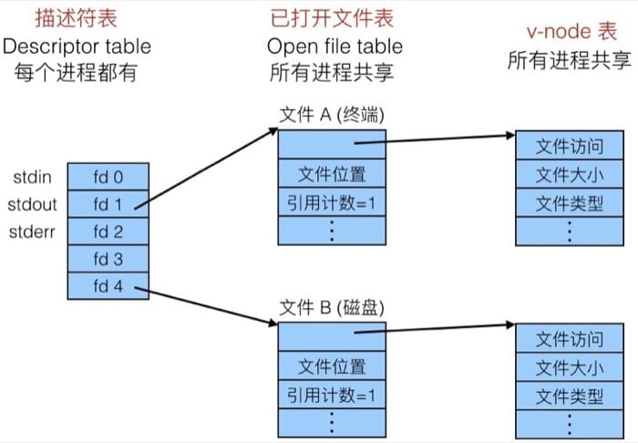
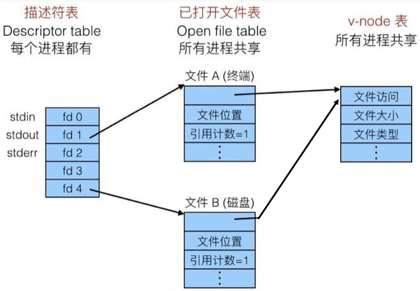
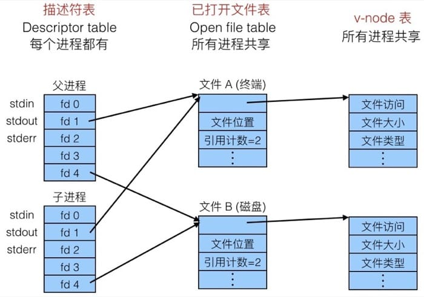
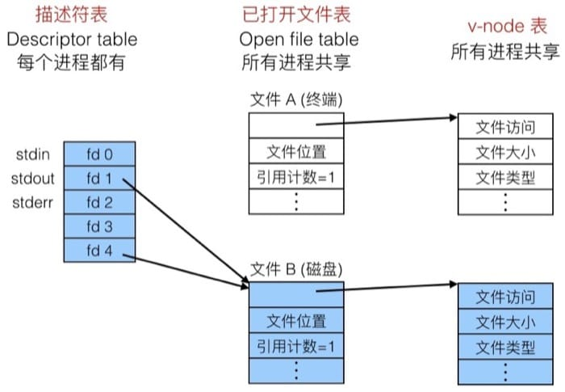
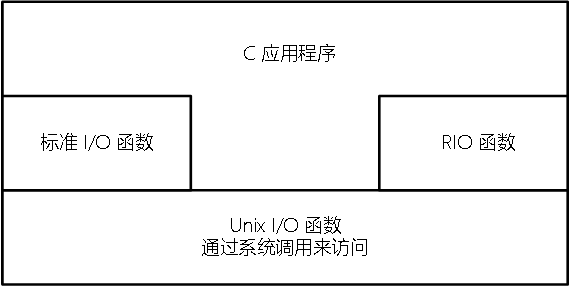

<center>10. 系统级I/O</center>
-----
[TOC]

# 1. Unix I/O

​	一个 Linux 文件就是一个 *m* 个字节的序列：
$$
B_o, B_1, ..., B_k, ..., B_{m-1}
$$
所有的 I/0 设备（例如网络、磁盘和终端）都被模型化为文件，而所有的输入和输出都被当作对相应文件的读和写来执行。这种将设备优雅地映射为文件的方式，允许 Linux 内核引出一个简单、低级的应用接口，称为 <font color=red>Unix I/O</font>，这使得所有的输入和输出都能以一种统一且一致的方式来执行。

- **打开文件**：一个应用程序通过要求内核打开相应的文件，来宣告它想要访问一个 I/O 设备。内核返回一个小的非负整数，叫做<font color=red>描述符</font>，它在后续对此文件中的所有操作中标识这个文件。Linux shell 创建的每个进程开始时都有三个打开的文件：标准输入(0)、标准输出(1)、标准错误(2)。

- **改变当前的文件位置**：对于每个打开的文件，内核保持着一个文件位置 *k*，这个文件位置是从文件开头起始的字节偏移量。

- **读写文件**

- **关闭文件**：内核释放文件打开时创建的数据结构，并将这个文件描述符恢复到可用的描述符池中。

# 2. 文件

每个 Linux 文件都有一个类型来表明它在系统中的角色：

- 普通文件(regular file)：包含任意数据。一般分为<font color=red>文本文件(text file)</font>和<font color=red>二进制文件(binary file)</font>。
- <font color=red>目录(directory)</font>：是包含一组<font color=red>链接(link)</font>的文件，其中每个链接都将一个<font color=red>文件名(filename)</font>映射到一个文件，这个文件可以是另一个目录。每个目录至少包含两个条目：`.` 是到该目录本身的链接；`..` 是到父目录的链接。
- <font color=red>套接字(socket)</font>：是用来与另一个进程进行跨网络通信的文件。

其他文件类型包含<font color=red>命名通道(named pipe)</font>、<font color=red>符号链接(symbolic link)</font>、以及<font color=red>字符和块设备(character and block device)</font>，这些不在本书的讨论范畴。

# 3. 文件操作

```c
#include <sys/types.h>
#include <sys/stat.h>
#include <fcntl.h>
#include <unistd.h>

/* 打开文件：返回的文件描述符总是在进程中当前没有打开的最小描述符 */
int open(char *filename, int flags, mode_t mode);

/* 关闭文件：成功返回 0；出错返回 -1 */
int close(int fd);

/* 读文件 */
ssize_t read(int fd, void *buf, size_t n);

/* 写文件 */
ssize_t write(int fd, const void *buf, size_t n);

/* 随机访问 */
off_t lseek(int fd, off_t offset, int whence);
```

`read` 函数从描述符为 fd 的当前文件位置复制最多 *n* 个字节到内存位置 buf。返回值 -1 表示一个错误；返回值 0 表示 EOF；否则，返回值表示的是==实际传送的字节数量==。

`write` 函数从内存位置 buf 复制至多 *n* 个字节到描述符 fd 的当前文件位置。返回值 -1 表示一个错误；否则，返回值表示的是传送的字节数量。

特殊情况下，`read` 和 `write` 传送的字节比应用程序要求的要少。这些不足值(short count)不表示有错误，出现这样的情况原因有：

- 读时遇到 EOF
- 从终端读文本行
- 读和写网络套接字(socket)

# 4. 用 RIO 包健壮的读写

​	在这一小节里，我们会讲述一个 I/O 包，称为 <font color=red>RIO(Robust I/O，健壮的 I/O 包)</font>，它会自动为你处理上文所述的不足值。在像网络程序这样容易出现不足值的应用中，RIO 包提供了方便、健壮和高效的 I/O。RIO 提供了两类不同的函数：

- **无缓冲的输入输出函数**：这些函数直接在内存和文件之间传送数据，没有应用级缓冲。
- **带缓冲的输入函数**：这些函数允许你高效地从文件中读取文本行和二进制数据，这些文件的内容缓存在应用级缓冲区内。

## 4.1 RIO 的无缓冲的输入输出函数

```c
#include "csapp.h"

ssize_t rio_readn(int fd, void *usrbuf, size_t n);
ssize_t rio_writen(int fd, void *usrbuf, size_t n);
```

## 4.2 RIO 的带缓冲的输入函数

```c
#include "csapp.h"

void rio_readinitb(rio_t *rp, int fd);

ssize_t rio_readlineb(rio_t *rp, void *usrbuf, size_t maxlen);
ssize_t rio_readnb(rio_t *rp, void *usrbuf, size_t n);

/* rio_read 函数是 Linux read 函数带缓冲的版本 */
static ssize_t rio_read(rio_t *rp, char *usrbuf, size_t n);
```

​	每打开一个描述符，都会调用一次 rio_readinitb 函数，它将描述符 fd 和地址 rp 处的一个类型为 rio_t 的读缓冲区联系起来。

​	rio_readlineb 函数从文件 rp 读出下一个文本行（包括结尾的换行符），将它复制到内存位置 usrbuf，并且用 NULL 字符来结束这个文本行。rio_readlineb 函数最多读 maxlen - 1个字节，余下的一个字符留给结尾的 NULL 字符。超过 maxlen - 1 字节的文本行被截断，并用一个 NULL 字符结束。

​	rio_readnb 函数从文件 rp 最多读 *n* 个字节到内存位置 usrbuf。对同一个文件描述符，带缓冲的函数可以交叉调用；却不应与无缓冲的 rio_readn 函数交叉使用。

# 5. 元数据

<font color=red>元数据(metadata) </font>是用来描述数据的数据，由内核维护，可以通过 `stat` 和 `fstat` 函数来访问：

```c
#include <unistd.h>
#include <sys/stat.h>
#include <sys/types.h>
#include <dirent.h>

struct stat {
    dev_t           st_dev;     // Device
    ino_t           st_ino;     // inode
    mode_t          st_mode;    // Protection & file type
    nlink_t         st_nlink;   // Number of hard links
    uid_t           st_uid;     // User ID of owner
    gid_t           st_gid;     // Group ID of owner
    dev_t           st_rdev;    // Device type (if inode device)
    off_t           st_size;    // Total size, in bytes
    unsigned long   st_blksize; // Blocksize for filesystem I/O
    unsigned long   st_blocks;  // Number of blocks allocated
    time_t          st_atime;   // Time of last access
    time_t          st_mtime;   // Time of last modification
    time_t          st_ctime;   // Time of last change
}

/* 以文件名为输入，填写信息到一个 stat 的数据结构中  */
int stat(const char *filename, struct stat *buf);

/* 以文件描述符为输入 */
int fstat(int fd, struct stat *buf);


/* 返回指向目录流的指针 */
DIR *opendir(const char *name);

/* 返回指向流 dirp 中下一个目录项的指针 */
struct dirent *renddir(DIR *dirp);

/* 关闭流并释放资源 */
int closedir(DIR *dirp);
```

# 6. 共享文件与 I/O 重定向

内核用三个相关的数据结构来表示打开的文件：

- **描述符表**（descriptor table）：==每个进程都有它独立的描述符表==，它的表项是由进程打开的文件描述符来索引的。每个打开的描述符表项指向**文件表**中的一个表项。

- **文件表**（file table）：打开文件的集合是由一张表来指示的，==所有的进程共享这张表==。每个文件表的表项组成包括**当前的文件位置**、**引用计数**（即当前指向该表项的描述符表项数），以及一个指向 v-node 表中对应的**指针**。关闭一个描述符会减少相应的文件表表项的引用计数，内核不会删除这个文件表表项，直到它的引用计数为零。

- **v-node 表**（v-node table）：同文件表一样，所有的进程共享这张表。每个表项包含 stat 结构中的大多数信息，包括 st_mode 和 st_size 成员。

### 1. 典型的文件打开

典型的打开文件的内核数据结构，两个描述符引用不同的文件，没有共享，如下图所示：



### 2. 文件共享

文件共享的内核数据结构，即多个描述符可以通过不同的文件表表项来引用同一个文件。关键思想是每个描述符都有它自己的文件位置，所以对不同描述符的读操作可以从文件的不同位置获取数据。



### 3. 父子进程共享文件

父子进程共享相同的打开文件集合，因此==共享相同的文件位置==。一个很重要的结果就是：在内和删除相应文件表表项之前，父子进程必须都关了它们的描述符。



### 4. I/O 重定向

```c
#include <unistd.h>

int dup2(int oldfd, int newfd);
```

`dup2` 函数复制==描述符表表项== oldfd 到描述符表表项 newfd，覆盖描述符表表项 newfd以前的内容。如果 newfd 已经打开了，`dup2` 会在复制 oldfd 之前关闭 newfd（即将 newfd 重新指向 oldfd 指向的文件表，如图所示）。



# 7. 标准 I/O

​	C 语言定义了一组高级输入输出函数，成为**标准 I/O** 库，标准 I/O 库将一个打开的文件模型化为一个**流**。类型为 FILE 的流是对**文件描述符**和**流缓冲区**的抽象。流缓冲区的目的和RIO读缓冲区的一样：就是使开销较高的 Linux I/O 系统调用的数量尽可能得小。

- 打开和关闭文件的函数：`fopen`、`fclose`

- 读和写字节的函数：`fread`、`fwrite`

- 读和写字符串的函数：`fgets`、`fputs`

- 格式化的 I/O 函数：`scanf`、`printf`



- 标准 I/O 函数：都是带缓冲的。

  - 流缓冲的函数：`fopen`、`fdopen`、`fclose`、`fread`、`fwrite`、`fscanf`、`fprintf`、`sscanf`、`sprintf`、`fgets`、`fputs`、`fflush`、`fseek`
  - 格式化的 I/O 函数：`scanf`、`printf`

- RIO 函数：

  - 无缓冲的输入输出函数：`rio_readn`、`rio_writen`
  - 带缓冲的输入函数：`rio_readinitb`、`rio_readlineb`、`rio_readnb`、`rio_read`

- Unix I/O 函数：`open`、`close`、`read`、`write`、`lseek`、`stat` 都是无缓冲的。

​	Unix I/O 是最通用最底层的 I/O 方法，较高级别的 RIO 和 标准 I/O 都是基于 Unix I/O 函数来实现的。Unix I/O 函数都是异步信号安全的，即可以在信号处理程序中调用。RIO 函数是本书中 `read` 和 `write` 替代的健壮的包装函数，它们自动处理不足值，并且为读问本行提供一种高效的带缓冲的方法。标准 I/O 函数提供了 Unix I/O 函数的一个更加完整的带缓冲的替代品，包括格式化 I/O。那么，如何选择合适的函数呢，如下：

- 只要有可能就使用标准 I/O。
- 不要使用 `scanf` 和 `rio_readlineb` 来读二进制文件。
- 对网络套接字的 I/O 使用 RIO 函数。