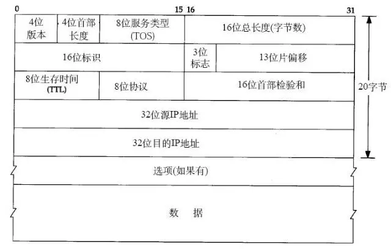

11.1 IP

[TOC]

# 1. IP 协议

**IP（Internet Protocol）**互联网络协议：提供端到端的**基本的命名机制**和**不可靠的数据包传送机制**。IP 协议是 TCP/IP 协议的核心，所有的 TCP、UDP 数据都以 IP 数据格式传输。要注意的是，IP 是不可靠的协议。这是说，IP 协议没有提供一种数据未传达以后的处理机制，这被认为是上层协议：TCP 或 UDP，要做的事情。、

# 2. IPv4 首部

IPv4 首部信息如下图所示，长度一般为 20 字节（不加选项数据）。

- **版本（Version）**：由 4 bit 构成，表示标识 IP 首部的版本号。IPv4 的版本号即为 4。
- **首部长度（Internet Header Length）**：由 4 bit 构成，表示 IP 首部的长度，单位为 4 Byte。对于没有可选项的 IP 包，首部长度设置为 5，即 20 Byte，最大是 60 Byte。
- **服务类型（Type Of Service）**：由 8 bit 构成，用来表明服务质量（这个值通常由应用设置，但截止到目前，几乎所有的网络都无视这些字段）。
- **总长度（Total Length）**：由 16 bit 构成，表示 IP 首部与数据部分合起来的总字节数。IP 包的最大长度为 $65536=2^{16}-1$ 字节。
- **生存时间（Time To Live）**：由 8 bit 构成，表示 IP 包可以中转多少个路由器的意思。每经过一个路由器，TTL 会减少 1，直至变成 0 则丢弃该包。
- **协议（Protocol）**：由 8 bit 构成，表示数据隶属哪个协议。例如：TCP-6，UDP-17，ICMP-1。
- **首部校验和（Header Checksum）**：由 16 bit 构成，该字段只校验数据报的首部，不校验数据部分。它主要用来确保 IP 数据报不被破坏。
- **源地址（Source Address）**：由 32 bit 构成，表示发送端 IP 地址。
- **目标地址（Destination Address）**：由 32 bit 构成，表示接收端 IP 地址。
