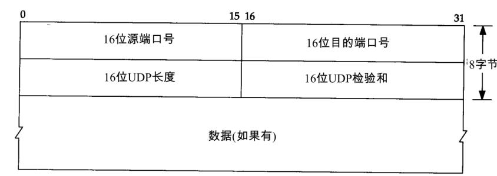

11.2 TCP、UDP

[TOC]

# 1. TCP/UDP 协议

- **TCP**：传输控制协议

  TCP 是一种面向连接的、可靠的、基于字节流的传输层通信协议。

- **UDP**：用户数据报协议

  UDP是一种不具有可靠的数据报协议。

|          |                       TCP                        |              UDP               |
| :------: | :----------------------------------------------: | :----------------------------: |
|  可靠性  |                       可靠                       |             不可靠             |
|  连接性  |                     面向连接                     |             无连接             |
|   报文   |                    面向字节流                    |            面向报文            |
|   效率   |                    传输效率低                    |           传输效率高           |
|  双工性  |                      全双工                      | 一对一、一对多、多对一、多对多 |
| 流量控制 |                     滑动窗口                     |               无               |
| 拥塞控制 |         慢开始，拥塞避免、快重传、快恢复         |               无               |
| 传输速度 |                        慢                        |               快               |
| 应用场景 | 对效率要求低，对准确性要求高或者要求有连接的场景 |  对效率要求高，对准确性要求低  |

**面向字节流**：

面向字节流的话，虽然应用程序和 TCP 的交互是一次一个数据块（大小不等），但 TCP 把应用程序看成是一连串的无结构的字节流。TCP 有一个缓冲，当应用程序传输的数据块太长，TCP 就可以把它划分短一些再传送。

**面向报文**：

面向报文的传输方式是应用层交给 UDP 多长的报文，UDP 就照样发送，即一次发送一个报文。因此，应用程序必须选择合适大小的报文。若报文太长，则 IP 层需要分片，降低效率；若太短，则 IP 太小，同样降低效率。

# 2. TCP/UDP 首部

## 2.1 TCP 首部格式

TCP 首部长度一般为 20 Byte（不加选项数据）。

- **源端口号（Source Port）**：表示发送端端口号，字段长16 bit。
- **目标端口号（Destination Port）**：表示接收端端口，字段长 16 bit。
- **序列号（Sequence Number）**：字段长 32 bit。序列号
- **确认应答号（Acknowledgement Number）**：字段长 32 bit。是指下一次应该收到的数据的序列号。实际上，它是指已收到确认应答号减一为止的数据。发送端收到这个确认应答以后可以认为在这个序号以前的数据都已经被正常接收。
- **数据偏移（Data Offse）**：字段长 4 bit，单位为 4 Byte。表示 TCP 所传输的数据部分应该从 TCP 包的哪个位开始计算，当然也可以把它看作 TCP 首部的长度。
- **保留（Reserved）**：字段长 6 bit，现在 4 bit 的版本。方便扩展。
- **控制位（Control Flag）**：字段长 6 bit。从左至右分别为：URG、ACK、PSH、PST、SYN、FIN。当它们对应位上的值为 1 时，有效。
  - **URG（Urgent Flag）**：表示包中有需要紧急处理的数据。
  - **ACK（Acknowledgement Flag）**：确认应答。TCP 规定处理最初建立连接时的 SYN 包之外该位必须设置为 1。
  - **PSH（Push Flag）**：该位为 1 时表示需要将收到的数据立刻传给上层应用协议。
  - **RST（Reset Flag）**：该位为 1 时表示 TCP 连接中出现异常必须强制断开连接。
  - **SYN（Synchronize Flag）**：用于建立连接。SYN 为 1 表示希望建立连接，并在其序列号的字段进行序列号初始值的设定。
  - **FIN（Fin Flag）**：用于断开连接。FIN 为 1 表示今后不会再有数据发送，希望断开连接。当通信结束希望断开连接时，通信双方的主机之间就可以相互交换 FIN 位置为 1 的 TCP 段。

- **窗口大小（Window Size）**：字段长 16 bit。用于通知
- **校验和（Checksum）**：字段长 16 bit。
- **紧急指针（Urgent Pointer）**：字段长 16 bit。只有在 URG 控制位为 1 时有效。该字段的数值表示本报文段中紧急数据的指针。

## 2.2 UDP 首部格式

UDP 首部长度为 8 Byte。

- **源端口号（Source Port）**：表示发送端端口号，字段长16 bit。
- **目标端口号（Destination Port）**：表示接收端端口，字段长 16 bit。
- **包长度（Length）**：该字段保存了 UDP 首部的长度和数据的长度之和，单位为 Byte，字段长16 bit。
- **校验和（Checksum）**：校验和是为了提供可靠的 UDP 首部和数据而设计，字段长16 bit。

# 3. TCP 连接的建立和终止

## 3.1 三次握手

## 3.2 四次挥手

# 4. TCP 流量控制

如果发送方把数据发送得过快，接收方可能会来不及接收，这就会造成数据的丢失。所谓**流量控制**就是让发送方的发送速率不要太快，要让接收方来得及接收。

利用**滑动窗口机制**可以很方便地在 TCP 连接上实现对发送方的流量控制。

# 5. TCP 拥塞控制

## 5.1 慢开始和拥塞避免

## 5.2 快重传和快恢复

### 快重传

快重传算法首先要求接收方每收到一个失序的报文段后就立即发出重复确认（为的是使发送方及早知道有报文段没有到达对方）而不要等到自己发送数据时才进行捎带确认。

**快重传算法还规定，发送方只要一连收到三个重复确认就应当立即重传对方尚未收到的报文段M3，而不必 继续等待M3设置的重传计时器到期。**

### 快恢复

- 当发送方连续收到三个重复确认，就执行“乘法减小”算法，把慢开始门限ssthresh减半。
- 不执行慢开始，而是直接从一半的门限处执行拥塞避免算法。

# 6. 从地址栏中输入网址后发生了什么

## 1. 缓存查找

当你在浏览器中输入了URL之后， 浏览器会先查看 **浏览器缓存** 中有没有这个地址， 如果没有那就再去 **系统缓存**， 如果系统缓存还没有， 那就去路由器缓存找， 总之只要缓存中有， 就说明有这个资源， 那浏览器直接显示出来就好了。

## 2. DNS 解析

DNS 解析的过程就是寻找哪台机器上有你需要的资源的过程，即把url转换成IP地址。

**DNS 负载均衡**：返回一个合适的 IP 地址给用户。

**DNS 污染**： 刻意或无意制造出来的域名服务数据包，把域名指向不正确的IP地址

## 3. TCP 链接

DNS 解析到 IP 地址之后，便发起 TCP 连接请求，即TCP 连接的三次握手。

# 4. HTTP 请求

握手成功后，浏览器就可以向服务器发送 http 请求了，请求数据包。发送 http 请求的过程就是构建http请求报文并通过 tcp 协议发送到服务器指定端口。http 请求报文是由三部分组成：请求行、请求报头、请求报文。

## 4.1 请求行

GET POST PUT DELETE OPTIONS HEAD

## 4.2 请求报头

请求报头允许客户端向服务器传递请求的附加信息和客户端自身的信息。

# 5. 服务器响应

HTTP响应报文也是由三部分组成: **状态码**, **响应报头**和**响应报文**。

# 6. 浏览器解析网页信息

