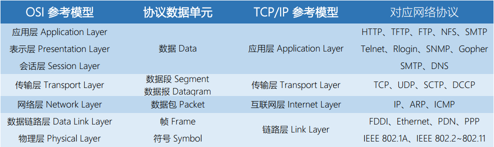

<center>11. 网络编程</center>
-----
[TOC]

# 1. 客户端-服务器模型

​	每个网络应用都是基于<font color=red>客户端-服务器</font>模型的，采用这个模型，一个应用是由一个**服务器进程**和一个或者多个**客户端进程**组成。服务器管理某种资源，并且通过操作这种资源来为它的客户端提供某种服务。客户端-服务器模型中的基本操作是<font color=red>事务(transaction)</font>，事务仅仅是客户端和服务器执行的一系列步骤。==客户端和服务器是进程==而不是主机。

# 2. 网络

OSI 参考模型与 TCP/IP 参考模型对比如下图所示：



计算机网络中的部分硬件设备：

|        设备        | 工作层次 | 作用 |
| ------------------ | :--: | :--: |
| 中继器（Repeater） | 物理层 | 从物理层上延长网络的设备 |
|   集线器（Hub）   | 物理层 | 集线器可以看作为多端口中继器 |
|   网桥（Bridge）2 层交换机（layer 2 switch）   | 数据链路层 | 从数据链路层上延长网络的设备 |
|  路由器（Router）3 层交换机（layer 3 switch）  | 网络层 | 通过网络层转发分组数据的设备 |
| 网关（Gateway） |  | 将从传输层到应用层的数据进行转换转发 |

​	互联网至关重要的特性是：他能由采用完全不同和不兼容技术的各种局域网和广域网组成。每台主机和其他每台主机都是物理连接的，但是如何能够让某台源主机跨过所有这些不兼容的网络发送数据到另一台目的主机呢？解决方法是一层运行在每台主机和路由器上的<font color=red>协议软件</font>。协议软件负责的事情有：

- 命名机制 naming scheme
  - 定义一种一致的主机地址 host address
  - 每台主机至少分配一个这种互联网络地址 internet address
- 传送机制 delivery mechanism
  - 定义一种把数据捆扎成不连续的片（称为包）的统一方式 packet
  - 一个包是由<font color=red>包头(header)</font>和<font color=red>有效载荷(payload)</font>组成的
    - 包头包括包的大小以及源主机和目的主机的地址
    - 有效载荷包括从源主机发出的数据位

## 2.1 全球 IP 因特网

​	每台因特网主机都运行实现 <font color=red>TCP/IP 协议</font>（Transmission Control Protocol/Internet Protocol，传输控制协议/互联网络协议）的软件。客户端和服务器混合使用**套接字接口**函数和 **Unix I/O** 函数来进行通信，这些实现为系统调用。

- IP(Internet Protocol) 互联网络协议
  - Provides **basic naming scheme** and unreliable **delivery capability** of packets (datagrams) from host-to-host
- UDP(Unreliable Datagram Protocol) 用户数据报协议
  - Uses IP to provide unreliable datagram delivery from process-to-process
  - UDP 是不具有可靠性的数据报协议
- TCP(Transmission Control Protocol) 传输控制协议
  - Uses IP to provide reliable byte streams from process-to-process over connections
  - TCP 是面向连接的、可靠的字节流协议

从程序员角度，我们可以把因特网看做一个世界范围的主机集合，满足一下特性：

- 主机集合被映射为一组 32 位的 IP 地址
- 这组 IP 地址被映射为一组称为<font color=red>因特网域名(Internet domain name)</font>的标识符
- 不同主机上的进程能够通过<font color=red>连接(connection)</font>来交换数据

## 2.2 IP 地址

​	IP地址通常采用**点分十进制表示法**来表示的，例如：`0x7f000001 = 127.0.0.1`。

```c
#include <arpa/inet.h>

/* IP address structure */
struct in_addr{
    uint32_t s_addr;	/* Address in network byte order (big-endian) */
}

uint32_t htonl(uint32_t hostlong);
uint16_t htons(uint16_t hostshort);

uint32_t ntohl(uint32_t netlong);
uint16_t ntohs(uint16_t netshort);

int inet_pton(AF_INT, const char *src, void *dst);
const char *inet_ntop(AF_INT, const void *src, char *dst, socklen_t size);
```

## 2.3 Internet 域名

## 2.4 Internet 连接

