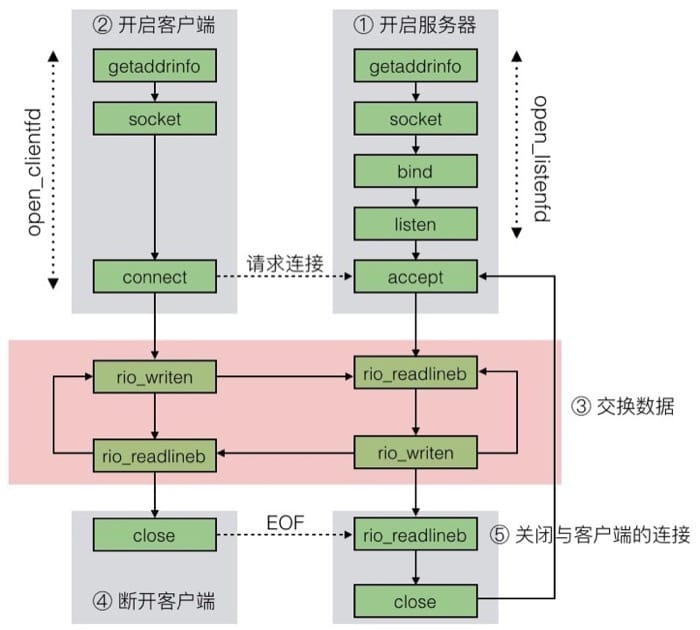

<center>11. 网络编程</center>
-----
[TOC]

# 1. 客户端-服务器模型

​	每个网络应用都是基于<font color=red>客户端-服务器</font>模型的，采用这个模型，一个应用是由一个**服务器进程**和一个或者多个**客户端进程**组成。服务器管理某种资源，并且通过操作这种资源来为它的客户端提供某种服务。客户端-服务器模型中的基本操作是<font color=red>事务(transaction)</font>，事务仅仅是客户端和服务器执行的一系列步骤。==客户端和服务器是进程==而不是主机。

# 2. 网络

OSI 参考模型与 TCP/IP 参考模型对比如下图所示：


计算机网络中的部分硬件设备：

|        设备        | 工作层次 | 作用 |
| ------------------ | :--: | :--: |
| 中继器（Repeater） | 物理层 | 从物理层上延长网络的设备 |
|   集线器（Hub）   | 物理层 | 集线器可以看作为多端口中继器 |
|   网桥（Bridge）2 层交换机（layer 2 switch）   | 数据链路层 | 从数据链路层上延长网络的设备 |
|  路由器（Router）3 层交换机（layer 3 switch）  | 网络层 | 通过网络层转发分组数据的设备 |
| 网关（Gateway） |  | 将从传输层到应用层的数据进行转换转发 |

​	互联网至关重要的特性是：他能由采用完全不同和不兼容技术的各种局域网和广域网组成。每台主机和其他每台主机都是物理连接的，但是如何能够让某台源主机跨过所有这些不兼容的网络发送数据到另一台目的主机呢？解决方法是一层运行在每台主机和路由器上的<font color=red>协议软件</font>。协议软件负责的事情有：

- 命名机制 naming scheme
  - 定义一种一致的主机地址 host address
  - 每台主机至少分配一个这种互联网络地址 internet address
- 传送机制 delivery mechanism
  - 定义一种把数据捆扎成不连续的片（称为包）的统一方式 packet
  - 一个包是由<font color=red>包头(header)</font>和<font color=red>有效载荷(payload)</font>组成的
    - 包头包括包的大小以及源主机和目的主机的地址
    - 有效载荷包括从源主机发出的数据位

## 2.1 全球 IP 因特网

​	每台因特网主机都运行实现 <font color=red>TCP/IP 协议</font>（Transmission Control Protocol/Internet Protocol，传输控制协议/互联网络协议）的软件。客户端和服务器混合使用**套接字接口**函数和 **Unix I/O** 函数来进行通信，这些实现为系统调用。

- IP(Internet Protocol) 互联网络协议
  - Provides **basic naming scheme** and unreliable **delivery capability** of packets (datagrams) from host-to-host
- UDP(Unreliable Datagram Protocol) 用户数据报协议
  - Uses IP to provide unreliable datagram delivery from process-to-process
  - UDP 是不具有可靠性的数据报协议
- TCP(Transmission Control Protocol) 传输控制协议
  - Uses IP to provide reliable byte streams from process-to-process over connections
  - TCP 是面向连接的、可靠的字节流协议

从程序员角度，我们可以把因特网看做一个世界范围的主机集合，满足一下特性：

- 主机集合被映射为一组 32 位的 IP 地址
- 这组 IP 地址被映射为一组称为<font color=red>因特网域名(Internet domain name)</font>的标识符
- 不同主机上的进程能够通过<font color=red>连接(connection)</font>来交换数据

## 2.2 IP 地址

IP地址通常采用**点分十进制表示法**来表示的，例如：`0x7f000001 = 127.0.0.1`。

```c
#include <arpa/inet.h>

/* IP address structure */
struct in_addr{
    uint32_t s_addr;	/* Address in network byte order (big-endian) */
}

uint32_t htonl(uint32_t hostlong);
uint16_t htons(uint16_t hostshort);

uint32_t ntohl(uint32_t netlong);
uint16_t ntohs(uint16_t netshort);

int inet_pton(AF_INT, const char *src, void *dst);
const char *inet_ntop(AF_INT, const void *src, char *dst, socklen_t size);
```

## 2.3 Internet 域名

<font color=red>域名(domain name)</font>：是一串用句点分割的单词，为了替代难记的 IP 地址。

<font color=red>DNS(Domain Name System，域名系统)</font>：因特网上作为域名和 IP 地址相互映射的一个分布式数据库。可以用 `nslookup` 命令来看。

## 2.4 Internet 连接

客户端和服务器通过在**连接**上发送和接收字节流来通信，特点是：

- 点对点：连接一对进程
- 全双工：数据可以同时双向流动
- 可靠：字节的发送顺序和收到的一致

一个<font color=red>套接字</font>是连接的一个端点。每个套接字都有相应的<font color=red>套接字地址</font>，是有一个因特网<font color=red>地址(IPaddress)</font>和一个 16 位的整数<font color=red>端口(port)</font>组成的，即 `IPaddress:port` 对。

端口用来标识不同的进程，利用端口来连接不同的服务：

- **临时端口**(ephemeral port)：客户端套接字地址的端口，由内核自动分配
- **知名端口**(well-known port)：服务器套接字地址的端口，和具体的服务对应；知名端口都有相对应的知名服务

# 3. Socket 接口

<font color=red>套接字接口(socket interface)</font>是一组函数，它们和Unix I/O 函数结合起来，用以创建网络应用。对于 Linux 内核，一个套接字就是通信的一个端点。对于 Linux 程序，套接字就是一个有相应描述符的打开文件。



```c
/* IP socket address structure */
struct socketaddr_in {
    uint16_t		sin_family;	/* Protocol family(always AF_INEF) 2 Byte */
    uint16_t		sin_port;	/* Port numbet in network byte order 2 Byte */
    struct in_addr	sin_addr;	/* IP address in network byte order 4 Byte */
    unsigned char	sin_zero[8];/* Pad to sizeof(struct sockaddr) 8 Byte */
};

/* Generic socket address structure(for connnet, bind, and accept) */
struct sockaddr {
    uint16_t	sa_family;		/* Protocol family */
    char 		sa_data[14];	/* Address data */
};
typedef struct sockaddr SA;
```

## 3.1 套接字接口函数

`socket()`,  `connect()`,  `bind()`,  `listen()`,  `accept()`

```c
#include <sys/types.h>
#include <sys/socket.h>

/* socket - 创建一个套接字描述符 */
int socket(int domain, int type, int protocol);

/* connect - 客户端调用 connet 函数建立和服务器的连接，得到套接字对 */
int connect(int clientfd, const struct sockaddr *addr, socklen_t addrlen);

/* bind - 将服务器套接字地址和套接字描述符联系起来 */
int bind(int sockfd, const struct sockaddr *addr, socklen_t addrlen);

/* listen - 将 sockfd 从一个主动套接字转化为一个监听套接字 */
int listen(int sockfd, int backlog);

/* accept - 等待客户端的连接请求，若连接成功，则返回一个已连接描述符 */
int accept(int listenfd, struct sockaddr *addr, int *addrlen);
```

## 3.2 主机和服务的转换

Linux 提供了一些强大的函数（称为 `getaddrinfo` 和 `getnameinfo`）实现**二进制套接字地址结构**和主机名、主机地址、服务名、端口号的字符串表示之间的相互转化。

```c
#include <sys/types.h>
#include <sys/socket.h>
#include <netdb.h>

struct addrinfo {
    int				ai_flags;		/* Hints argument flags */
    int				ai_family;		/* First arg to socket function */
    int				ai_socktype;	/* Second arg to socket function */
    int				ai_protocol;	/* Third arg to socket function */
    char			*ai_canonname;	/* Canonical hostname */
    size_t			ai_addrlen;		/* Size of ai_addr struct */
    struct sockaddr	*ai_addr;		/* Ptr to socket address structure */
    struct addrinfo	*ai_next;		/* Ptr to next item in linked list */		
}

/* getaddrinfo - 返回：如果成功则为 0，如果错误则为非零的错误代码 */
int getaddrinfo(const char *host, const char *service, 
                const struct addrinfo *hints, struct addrinfo **result);

void freeaddrinfo(struct addrinfo *result);

const char *gai_strerror(int errcode);

/* getnameinfo - 返回：如果成功则为 0，如果错误则为非零的错误代码 */
int getnameinfo(const struct sockaddr *sa, socklen_t aslen, 
                char *host, size_t hostlen, 
                char *service, size_t servlen, int flags);
```

### 1. `getaddrinfo` 函数

​	给定 host 和 service，`getaddrinfo` 返回 result，result 是一个指向 addrinfo 结构的链表，其中每个结果指定一个对应于 host 和 service 的套接字地址结构。为了避免内存泄漏，应用程序必须在最后调用 `freeaddrinfo`，释放该链表。如果 `getaddrinfo` 返回非零的错误代码，应用程序可以调用 `gai_strerror`，将该代码转换成消息字符串。

​	`getaddrinfo` 的 host 参数可以是域名，也可以是点分十进制 IP 地址；service 参数可以是服务名（如 http），也可以是十进制端口；如果不想吧主机名转换成地址，可以把 host 设置为 NULL，对 service 来说也是一样，但必须指定二者中至少一个。可选的参数 hints 是一个 addrinfo 结构，它提供对 `getaddrinfo` 返回的套接字地址列表的更好的控制。addrinfo 结构可以直接传递给套接字接口中的函数，ai_family、ai_socktype、ai_protocol 可以直接传递给 `socket`；ai_addr、ai_addrlen 可以直接传递给 `connect` 和 `bind`。

### 2. `getnameinfo` 函数

​	`getnameinfo` 函数和 `getaddrinfo` 是相反的，将一个套接字地址结构转换成相应的主机和服务名字符串。

## 3.3 套接字接口的辅助函数

`open_clientfd()`、`open_listenfd()` 

```c
#include "csapp.h"

/* 客户端调用 open_clientfd 建立与服务器的连接，返回 clientfd */
int open_clientfd(char *hostname, char *port);

/* 服务器调用 open_listenfd 创建一个监听描述符，返回 listenfd */
int open_listenfd(char *port);
```

# 4. Web 服务器

​	Web 客户端和服务器之间的交互用的是一个基于文本的应用级协议，叫做 <font color=red>HTTP</font>(Hypertext Transfer Protocol，超文本传输协议)。Web 内容可以用一种叫做 <font color=red>HTML</font>(Hypertext Markup Language，超文本标记语言)的语言来编写。

```bash
# HTTP 事务示例
GET / HTTP/1.1				# request line		请求行   一行
Host: www.aol.com			# request header	请求报头 一行或多行	
							# empty line		空行 终止报头列表
HTTP/1.0 200 OK				# response line		响应行   一行
Content-Type: text/html
Content-Length: 42092		# response header	响应报头 一行或多行
							# empty line		空行 终止报头列表
<html>
...
</html>						# response body		响应主体

# HTTP 事务模型
method URI version
header-name: header-data

version status-code status-message
# 响应报头
...
# 响应报头

# 响应主体
# ...
# 响应主体
```

# 5. 小结

​	每个网络应用都是基于**客户端-服务器模型**的。根据这个模型，一个应用是由一个服务器和一个或多个客户端组成的。服务器管理资源，以某种方式操作资源，为它的客户端服务。客户端-服务器模型中的基本操作是客户端-服务器**事务**，它是由客户端请求和跟随其后的服务器响应组成的。

​	客户端和服务器通过使用**套接字接口**建立连接。一个套接字是连接的一个端点，连接以**文件描述符**的形式提供给应用程序。客户端和服务器通过读写这些描述符来实现彼此间的通信。