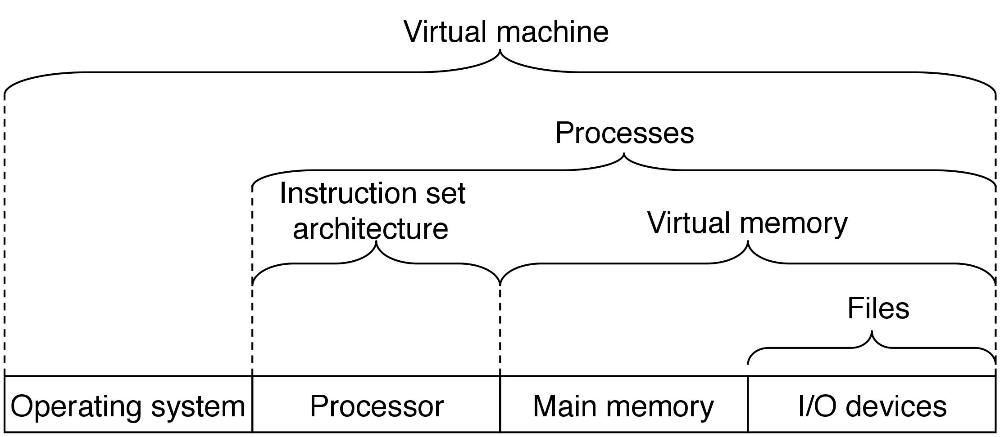

12. 并发编程

-----
[TOC]

# 1. 并发编程

​	使用应用级并发的应用程序称为并发程序(concurrent  program)，现代操作系统提供了三种基本的构造并发程序的方法。

- **进程（process）**：用这种方法，每个控制逻辑流都是一个进程，由内核调度和维护。因为进程有独立的虚拟地址空间，想要和其他进程通信，控制流必须使用某种显示的进程间通信（interprocess communication，IPC）机制
- **I/O 多路复用（I/O multiplexing）**：在这种形式的并发编程中，应用程序在一个进程的上下文中显式地调度它们自己的逻辑流。逻辑流被模型化为状态机，数据到达文件描述符后，主程序显式地从一个状态转换到另一个状态。因为程序是一个单独的进程，所以所有的流都共享同一个地址空间。
- **线程（thread）**：线程是运行在一个单一进程上下文中的逻辑流，由内核进行调度。你可以把线程看成是其他两种方式的混合体，像进程流一样由内核进行调度，而像 I/O 多路复用流一样共享一个虚拟地址空间。

进程与线程的区别：**进程和线程都是一个时间段的描述，是CPU工作时间段的描述，不过是粒度大小不同**。

- 进程(process)：进程是执行中程序的实例。程序运行在进程的上下文中。一个进程的上下文一般包括：代码、数据、用户栈，通用目的寄存器、程序计数器，环境变量以及打开文件描述符的集合。
- 线程(thread)：线程是运行在进程上下文中的逻辑流。每个线程都有它自己的线程上下文，包括一个唯一的整数线程 ID、栈、栈指针，通用目的寄存器、程序计数器，条件码。

# 2. 基于进程的并发编程

