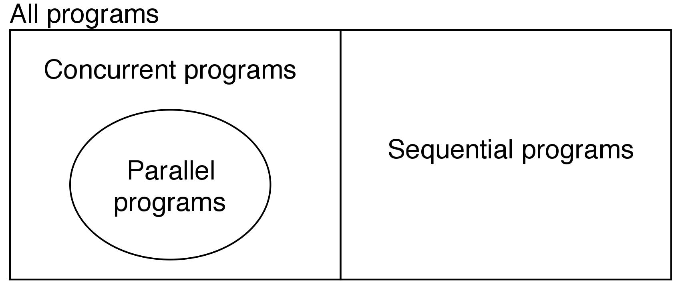
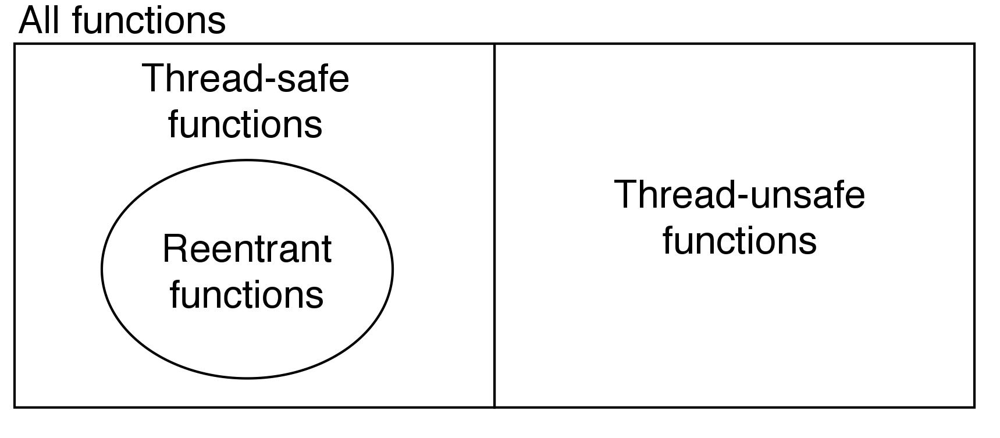
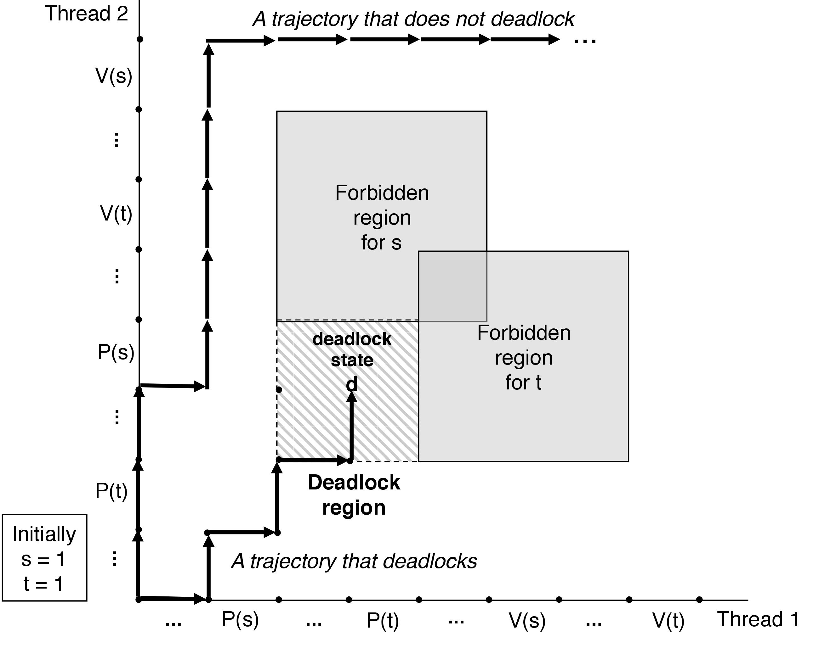

<center>12. 并发编程</center>
-----
[TOC]

# 1. 并发编程

​	使用应用级并发的应用程序称为<font color=red>并发程序(concurrent  program)</font>，现代操作系统提供了三种基本的构造并发程序的方法。

- **进程（process）**：用这种方法，每个控制逻辑流都是一个进程，由内核调度和维护。因为进程有独立的虚拟地址空间，想要和其他进程通信，控制流必须使用某种显示的<font color=red>进程间通信</font>（interprocess communication，<font color=red>IPC</font>）机制
- **I/O 多路复用（I/O multiplexing）**：在这种形式的并发编程中，应用程序在一个进程的上下文中显式地调度它们自己的逻辑流。逻辑流被模型化为状态机，数据到达文件描述符后，主程序显式地从一个状态转换到另一个状态。因为程序是一个单独的进程，所以所有的流都共享同一个地址空间。
- **线程（thread）**：线程是运行在一个单一进程上下文中的逻辑流，由内核进行调度。你可以把线程看成是其他两种方式的混合体，像进程流一样由内核进行调度，而像 I/O 多路复用流一样共享一个虚拟地址空间。


进程与线程的区别：**进程和线程都是一个时间段的描述，是CPU工作时间段的描述，不过是粒度大小不同**。

- <font color=red>进程(process)</font>：进程是执行中程序的实例。程序运行在<font color=red>进程的上下文</font>中。一个进程的上下文一般包括：代码、数据、用户栈，通用目的寄存器、程序计数器，环境变量以及打开文件描述符的集合。
- <font color=red>线程(thread)</font>：线程是运行在进程上下文中的逻辑流。每个线程都有它自己的<font color=red>线程上下文</font>，包括一个唯一的整数线程 ID、栈、栈指针，通用目的寄存器、程序计数器，条件码。

# 2. 基于进程的并发编程

​	对于父、子进程间共享状态信息，进程有一个非常清晰的模型：共享文件表，但是不共享用户地址空间。进程有独立的地址空间既是优点也是缺点。优点是：一个进程不可能不小心覆盖另一个进程的虚拟内存；缺点是：独立的地址空间使得进程共享状态信息变得更加困难，为了共享信息，必须使用显式的 IPC(进程间通讯) 机制。

# 3. 基于 I/O 多路复用的并发编程

```c
#include <sys/select.h>

/* 返回已准备好的描述符的非零的个数，若出错则为 -1 */
int select(int n, fdset *fdset, NULL, NULL, NULL);

/* c处理描述符集合的宏 */
FD_ZERO(fd_set *fdset);				/* Clear all bits in fdset */
FD_CLR(int fd, fd_set *fdset);		/* Clear bit fd in fdset */
FD_SET(int fd, fd_set *fdset);		/* Turn on bit fd in fdset */
FD_ISSET(int fd, fd_set *fdset);	/* Is bit fd in fdset on */ 
```

​	I/O 多路复用可以用做并发<font color=red>事件驱动(event-driven)</font>程序的基础，在事件驱动程序中，某些事件会导致流向前推进。一般的思路是将逻辑流模型化为状态机。不严格的说，一个<font color=red>状态机(state machine)</font>就是一组<font color=red>状态(state)</font>、<font color=red>输入事件(input event)</font>和<font color=red>转移(transition)</font>，其中转移是将**状态和输入事件**映射到**状态**。事件驱动设计的优缺点如下：

- 优点：
  - 比基于进程的设计给了程序员更多的对程序行为的控制
  - 运行在单一进程上下文中，每个逻辑流都能访问该进程的全部地址空间
  - 事件驱动设计常常比基于进程的设计要高效得多，因为它们不需要进程上下文切换来调度新的流
- 缺点：
  - 编码复杂
  - 不能充分利用多核处理器

# 4. 基于线程的并发编程

​	<font color=red>线程(thread)</font>就是运行在进程上下文中的逻辑流。线程由内核自动调度，每个线程都有它自己的**线程上下文**(thread context)，包括一个唯一的整数**线程 ID**(Thread ID, TID)，栈、栈指针、程序计数器、通用目的寄存器和条件码，所有的运行在一个进程里的线程共享该进程的整个虚拟地址空间。每个进程开始生命周期时都是一个单一线程，这个线程称为<font color=red>主线程(main thread)</font>。在某一时刻，主线程创建一个<font color=red>对等线程(peer thread)</font>，从这个时间点开始，两个线程就并发的运行。

​	线程的执行是不同于进程的。一方面是：一个线程的上下文要比一个进程的上下文小的多，线程的上下文切换要比进程的上下文切换快的多；另一方面是：线程不是严格按父子层次来组织的，同一个进程内的线程组成一个<font color=red>对等（线程）池</font>。对等池概念的主要影响是：一个线程可以杀死任何它的任何对等线程，或者等待它的任何对等线程终止。另外，每个对等线程都能读写相同的共享数据。

## 4.1 POSIX 线程

​	POSIX 线程(Pthreads)是在 C 程序中处理线程的一个标准接口。Pthreads　定义了一套C语言的类型、函数与常量，它以 `pthread.h` 头文件和一个线程库实现。Pthreads API 中大致共有 100 函数调用，全都以 `pthread_` 开头、并可以分为四类。

1. 线程管理：例如创建线程、等待(join)线程等

2. 互斥锁(Mutex)

3. 条件变量(Condition Variable)

4. 使用了互斥锁的线程间的同步管理

POSIX 的 Semaphore API 可以和 Pthreads 协同工作，但这并不是 Pthreads 的标准。因而这部分 API 是以`sem_` 打头，而非`pthread_`。 

## 4.2 线程控制

终止线程的方式有很多，如下：

- 线程可能在某些情况下终止
  - 线程例程返回，即 `return`
  - 线程调用 `pthread_exit()` 函数终止
  - 线程被另一个线程通过 `pthread_cancel()` 函数终止，类似于通过 `kill()` 函数发送 SIGKILL 信号
- 在以下情景中，进程中的所有线程都被杀死
  - 进程从 `main()` 函数中返回，即 `return`
  - 进程调用 `exit()` 函数终止
  - 进程通过 `execve() `函数加载并执行程序

```c
#include <pthread.h>
typedef void *(func)(void *);

/* 获取自己的线程 ID */
pthread_t pthread_self(void);

/* 创建线程：线程调用 pthread_create() 来创建其他线程 */
int pthread_create(pthread_t *tid, pthread_attr_t *attr, func *f, void *arg);
/* 终止线程 */
void pthread_exit(void *thread_return);
int pthread_cancel(pthread_t tid);

/* 回收已终止的线程 */
int pthread_join(pthread_t tid, void **thread_return);

/* 分离线程 */
int pthread_detach(pthread_t tid);

/* 初始化线程 */
pthread_once_t once_control = PTHREAD_ONCE_INIT;
int pthread_once(pthread_once_t *once_control, void(*init_routine)(void));
```

`pthread_join()` 函数会阻塞，直到线程 tid 终止，将线程例程返回的通用(void *)指针赋值为 thread_return 指向的位置，然后回收已终止线程占用的所有内存资源。

线程状态分为<font color=red>可结合的(joinable)</font>或者是<font color=red>分离的(detached)</font>：

- 可结合的：能够被其他线程杀死和回收；在被其他线程回收之前，它的内存资源（例如栈）是不释放的。

- 分离的：不能被其他线程杀死或回收的；它的内存资源在它终止时由系统自动释放。

默认情况下，线程被创建成可结合的。为了避免内存泄漏，每个可结合线程都应该要么被其他线程显式的收回，要么通过调用 `pthread_detach()` 函数被分离。

# 5. 共享变量

​	C 语言多线程程序中，我们如何判断一个变量是否是共享的，有一些基本的问题要解答：1）线程的基础内存模型是什么？2）根据这个模型，变量实例是如何映射到内存的？3）最后，有多少程序引用这些实例？一个变量是<font color=red>共享</font>的，**当且仅当多个线程引用这个变量的某个实例**。

## 5.1 线程内存模型

​	一组并发线程运行在一个进程的上下文中。**每个线程都有它自己独立的线程上下文**，包括线程 ID、栈、栈指针、程序计数器、条件码和通用目的寄存器值。**每个线程和其他线程一起共享进程上下文的剩余部分**：包括制衡个用户虚拟地址空间，它是由只读（代码）、读/写数据、堆以及所有的共享库代码和数据区域组成的。线程也共享相同的打开文件的集合。寄存器是从不共享的，而虚拟内存总是共享的。如果一个线程以某种方式得到一个指向其他线程栈的指针，那么它就可以读写这个栈的任何部分。

## 5.2 将变量映射到内存

多线程的 C 程序中变量根据它们的存储类型被映射到虚拟内存：

- **全局变量**：全局变量是定义在函数之外的变量。在运行时，虚拟内存的读/写区域只包含每个全局变量的一个实例，任何线程都可以引用。
- **局部静态变量**：局部静态变量是定义在函数内部并有 static 属性的变量。和全局变量一样，虚拟内存的读/写区域只包含 在程序中声明的每个局部静态变量 的 一个实例。
- **局部自动变量**：局部自动变量是定义在函数内部但没有 static 属性的变量。在运行时，每个线程的栈都包含 它自己的所有局部自动变量 的 实例。

## 5.3 共享变量

​	一个变量 *v* 是共享的，当且仅当它的一个实例被一个以上的线程引用。

# 5. 用信号量同步线程

​	<font color=red>信号量（semaphore）</font> 是一个特殊类型变量。信号量 *s* 是具有非负整数值的全局变量，只能有两种特殊的操作来处理，这两种操作成为 **P**（wait()） 和 **V**（post()）。

- **P(*s*)**：如果 s 是非零的，那么 **P** 将 s 减 1，并且立即返回到调用线程；如果 s 是零，那么就**挂起当前线程**，直到 s 变为非零，而一个 **V** 操作会**重启挂起的线程**。在重启之后，P 操作将 s 减 1 并返回到调用线程。
- **V(*s*)**：**V** 操作将 s 加 1。如果有任何线程阻塞在 **P** 操作等待 s 变为非零，那么 **V** 操作会重启这些线程中的一个，然后执行 **P** 操作。即**当有多个线程在等待同一个信号量时，不能预测 V 操作会重启哪一个线程**。

```c
#include <semaphore.h>

int sem_init(sem_t *sem, 0, unsigned int value);
int sem_wait(sem_t *s);		/* P(s) */
int sem_post(sem_t *s);		/* V(s) */
```

==注意==：在使用线程时，脑中要有一个清晰的共享变量的概念，共享变量需要==互斥访问==，而==信号量==是一个基础机制。

## 5.1 互斥锁（mutex）

- **二元信号量（binary semaphore）**：将一个共享变量与一个信号量 s（初始为 1）关联起来，然后用  **P / V** 操作保护临界区，这种信号量成为二元信号量（值总是 0 或 ）

- **互斥锁（mutex）**：以提供互斥为目的的二元信号量也成为互斥锁（mutex）。在一个互斥锁上执行 P 操作称为对互斥锁**加锁**；执行 P 操作称为对互斥锁**解锁**。

- **计数信号量**：表示一组可用资源计数器的信号量。

## 5.2 使用线程提高并行性

**使用互斥锁同步线程开销巨大，要尽可能避免。如果无可避免，必须要用尽可能多的有用计算弥补这个开销。**

- **顺序程序**：Sequential programs
- **并发程序**：Concurrent programs
  - **并行程序**：Parallel programs，一个运行在多个处理器上的并发程序。

## 5.3 并发问题

### 1. 线程安全

- **线程安全（thread-safe）**：一个函数被称为线程安全的，当且仅当被多个并发线程反复地调用时，它会一直产生正确的结果。
- **线程不安全的（thread-unsafe）**：如果一个函数不是线程安全的，我们就说它是线程不安全的。主要有 4 类线程不安全的函数：
  - **不保护共享变量**的函数
    - 解决方法：使用 **P / V** 同步操作来保护共享变量
    - 优点：调用程序中不需要做修改
    - 缺点：同步操作将减慢程序的执行时间
  - **在多次调用间保持状态**的函数
    - 解决方法：把状态当作传入参数
  - **返回指向静态变量的指针**的函数
    - 解决方法 1：重写函数
    - 解决方法 2：使用加锁-复制（lock-and-copy）技术
  - **调用线程不安全函数**的函数：例如函数 f 调用 线程不安全的函数 g：
    - 如果 g 是第 2 类函数：函数 f 也是线程不安全的，只能重写 g
    - 如果 g 是第 1 or 3 类函数：使用相应的解决方法，f 有可能是线程安全的

### 2. 可重入性



- **可重入函数（reentrant functions）**：有一类重要的线程安全函数，叫做可重入函数，它们具有一种属性，即：**当它们被多个线程调用时，不会引用<font color=red>任何</font>共享数据**。

  - **显式可重入的**：<font color=red>所以的函数参数都是传值传递的</font>（没有指针），并且<font color=red>所有的数据引用都是本地的自动栈变量</font>（没有引用静态或全局变量）。
  - **隐式可重入的**：<font color=red>允许显式可重入函数中的一些参数是引用传递的</font>（允许传递指针）。

​	大多数 Linux 函数，包括定义在标准 C 库中的函数（例如 `malloc`、`free`、`realloc`、`printf`、`scanf` 等）都是线程安全的，只有一小部分是线程不安全的；对于线程不安全的函数，Linux 提供了大多数线程不安全的函数的可重入版本，以 `_r` 结尾。如下图所示：

| 线程不安全函数 | 线程不安全类 | Linux 线程安全版本 |
| :------------: | :----------: | :----------------: |
|      rand      |      2       |       rand_r       |
|     strtok     |      2       |      strtok_r      |
|    asctime     |      3       |     asctime_r      |
|     ctime      |      3       |      ctime_r       |
| gethostbyaddr  |      3       |  gethostbyaddr_r   |
| gethostbyname  |      3       |  gethostbyname_r   |
|   inet_ntoa    |      3       |    inet_ntoa_r     |
|   localtime    |      3       |    localtime_r     |

### 3. 竞争

**竞争（race）**：当一个程序的正确性依赖于 **A 线程要在 B 线程到达 *y* 点前到达它的控制流中的 *x* 点**时，就会发生竞争。即程序假设：线程按照特殊的轨迹线穿过执行状态空间；而实际上多线程的程序必须对任何可行的轨迹线都能正确工作。

### 4. 死锁

**死锁（deadlock）**：即一组线程被阻塞了，等待一个永远也不会为真的条件。用进程图表示如下：



- 程序员使用 **P / V** 操作顺序不当，以至于两个信号量的禁止区域重叠。如果执行轨迹线到达死锁状态 **d**，就会发生死锁。
- 重叠的区域引起了一组称为**死锁区域（deadlock region）** 的状态，轨迹线到达死锁区域后不可能离开。
- 死锁是一个困难的问题，因为它不总是可预测的。
- **互斥锁加锁顺序原则**：给定所有互斥操作的一个全序，如果每个线程都是以一种顺序获得互斥锁并以相反的顺序释放，那么这个程序就是无死锁的。

