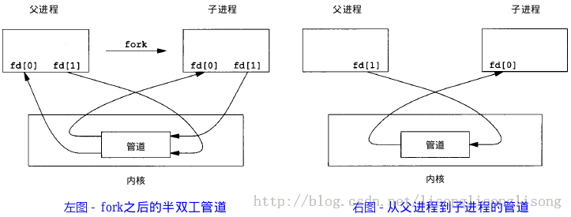
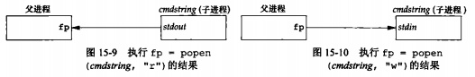
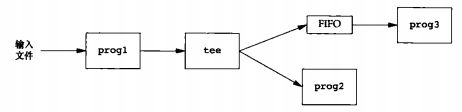
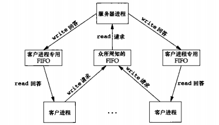

<center>13. 进程/线程</center>
-----
[TOC]

# 1. 进程、线程

## 1. 1 进程与线程的基本概念

- **进程**：是系统进行资源分配和调度运行的基本单位。进程的经典定义就是一个执行中程序的实例。
- **线程**：是系统进行调度分配的基本单位。每个进程至少包含一个线程，那就是主线程。线程自己只拥有很少的系统资源，如栈、栈指针、程序计数器、通用目的寄存器和条件码；所有运行在一个进程里的线程共享该进程的整个虚拟地址空间。

## 1.2 进程与线程的区别

线程也称为轻量级进程。下面，我们主要从调度、并发性、系统开销、资源拥有等方面来对线程和进程进行比较。

- **调度**：引入线程的操作系统中，线程作为 CPU 调度和分配的基本单位，进程则作为资源拥有的基本单位，线程可以轻装运行，这样可以显著地提高系统的并发性。同一进程中线程的切换不会引起进程切换（上下文切换），从而避免了昂贵的系统调用。
- **并发性**：引入线程的操作系统中，不仅进程间可以并发执行，而且一个进程中的多个线程间也可以并发执行，使操作系统具有更好的并发性，从而能更有效地使用系统资源和提高系统的吞吐量。
- **系统开销**：线程只拥有很少的系统资源，却可以访问其隶属进程的资源，如代码段、数据段、及已打开的文件、I/O 设备等系统资源。
- **资源拥有**：创建或撤销进程时，系统都要分配或回收资源。因此，操作系统付出的开销将显著地大于创建或撤销线程的开销。线程切换主要保存栈、栈指针、程序计数器、通用目的寄存器和条件码；进程切换通过上下文切换实现，要保存和恢复整个虚拟内存空间，把控制交给新进程。

进程的状态：运行、停止、终止。

线程的状态：就绪、运行、等待、消亡。

# 2. 进程间通信（IPC）

## 2.1 管道

**管道（pipe）**：从一个进程连接数据流到另一个进程。管道具有如下特点：

- 管道是半双工的，具有固定的读端和写端。即把一个进程的输出通过管道连接到另一个进程的输入。
- 管道只能在具有公共祖先的两个进程之间使用，即父子进程或兄弟进程间使用。
- 管道可以看成是一种特殊的文件，对于它的读写也可以使用普通的 `read`、`write` 等函数。但它不是普通的文件，并不属于任何文件系统，只存在内存中。

### 1. 管道创建

```c
#include <unistd.h>

int pipe(int fd[2]);		// 返回值：若成功，返回0；若失败，返回-1
```

当一个管道建立时，它会创建两个文件描述符：`fd[0]` 为读而打开，`fd[1]` 为写而打开。如下图：


单个进程中的管道几乎没有任何用处。所以，通常调用 pipe 的进程接着调用 fork，这样就创建了父进程与子进程之间的通道。如下图：



 ### 2. 函数 popen 和 pclose

这两个函数实现的操作是：创建一个管道，fork 一个字进程，关闭未使用的管道端，执行一个 shell 运行命令，然后等待命令终止。

```c
#include <stdio.h>

FILE *popen(const char *cmdstring, const char *type);
												// 返回值：若成功，返回文件指针；若出错，返回NULL
int pclose(FILE *fp);		// 返回值：若成功，返回cmdstring的终止状态；若出错，返回-1
```

函数 popen 先执行 fork，然后调用 exec 执行 cmdstring，并且返回一个标准 I/O 文件指针。如果 type 是 `r`，则文件指针连接到 cmdstring 的标准输出；如果 type 是 `w`，则文件指针连接到 cmdstring 的标准输入。如下图：



函数 pclose 关闭标准 I/O流，等待命令终止，然后返回 shell 的终止状态。

### 3. 协同进程

当一个进程既要产生某个程序的输入，又读取该程序的输出时，它就变成了协同程序（coprocess）。

==差一个图==

## 2.2 FIFO

**FIFO**：有时被称为命名管道，它是一种文件类型。FIFO 具有以下特点：

- FIFO 是 “先进先出” 的数据类型。

- FIFO 可以在无关的进程之间交换数据，与管道不同。
- FIFO 有路径名与之相关联，它以一种特殊设备文件形式存在文件系统中。

### 1. FIFO 创建

创建 FIFO 类似与创建文件。

```c
#include <sys/stat.h>

int mkfifo(const char *pathname, mode_t mode);
int mkfifoat(int fd, const char *path, mode_t mode);
												// 两个函数的返回值：若成功，返回0；若出错，返回-1
```

其中的 mode 参数的规格说明与 open 函数中的 mode 相同。

### 2. FIFO 用途

FIFO 有以下两种用途：

- shell 命令使用 FIFO 将数据从一条管道传送到另一条时，无需创建中间临时文件。
- 客户端进程-服务器进程应用程序中，FIFO 用作汇聚点，在客户进程和服务器进程二者这件传递数据。

#### 用 FIFO 复制输出流

```bash
mkfifo fifo1
prog3 < fifo1 &
prog1 < infile | tee fifo1 | prog2		# tee 进行重定向到文件
```



#### 用 FIFO 进行客户端进程-服务器进程通信

如果有一个服务器进程，它与很多客户进程有关，每个进程都可将其请求写到一个该服务器进程创建的众所周知的  FIFO 中。服务器响应各个客户端进程时，一种解决方法是：服务器为每个客户进程创建一个与客户进程 PID 相关的 FIFO。如下图所示：



## 2.3 XSI IPC：消息队列

有 3 种称作 XSI IPC 的 IPC：消息队列、信号量和共享内存。

- **消息队列**：在程序间传递数据的一种简单方法。
- **信号量**：用于管理对资源的访问。
- **共享内存**：在程序间高效地共享数据。

### 1. 标识符和键

内核中的每个 IPC 结构（消息队列、信号量和共享内存）都用一个非负整数的**标识符**（identifier）加以引用。例如：要向一个消息队列发送消息或者从一个消息队列取消息，只需要知道其队列标识符。IPC 结构的标识符在创建和删除后并不会重新计数，而是连续累加直至达到最大值，然后又回转到 0。

标识符是 IPC 结构的内部名。为使多个合作进程能够在同一 IPC 对象上汇聚，需要提供一个外部命名方案。为此，每个 IPC 对象都与一个**键（key）**相关联，将这个键作为该对象的外部名。**这个键由内核变换成标志符**。

### 2. 消息队列

消息队列是消息的链接表，存储在内核中，由消息队列标识符标识。消息队列标识符简称为队列 ID。

- 消息队列是面向记录的，其中的消息具有特定的格式和特定的优先级。

- 消息队列独立于发送和接收进程。进程终止时，消息队列及其内容并不会被删除。
- 从消息队列中获取消息时，如果不加特殊设置，它就是 FIFO 类型的；当设置了相应参数后，可以按消息的类型读取，即随机查询。

### 3. 相关函数

```c
#include <sys/msg.h>

// 创建和访问一个消息队列
int msgget(key_t key, int flag);		// 返回值：若成功，返回消息队列 ID；若出错，返回-1
// 控制消息队列：例如删除
int msgctl(int msqid, int cmd, struct msqid_ds *buf);
// 把消息添加到消息队列中
int msgsnd(int msqid, const void * msg_ptr, size_t msg_sz, int msgflg);
// 从消息队列中接收消息
int msgrcv(int msqid, void * msg_ptr, size_t msg_sz, long int msgtype, int msgflg);
																		//三个函数的返回值：若成功，返回0；若出错，返回-1
```

## 2.4 XSI IPC：信号量

**信号量**：信号量是一个计数器，用于实现进程间的互斥和同步，而不是用于存储进程间通信数据。

- 信号量用于进程间同步，若要在进程间传递数据需要结合共享内存。
- 信号量基于操作系统的 PV 操作，程序对信号量的操作都是原子操作。
- 每次对信号量的 PV 操作不仅限于加 1 或减 1，可以加减任意正整数。
- 支持信号组。

## 2.5 XSI IPC：共享内存

**共享内存**：指两个或多个进程共享一个给定的存储区。

- 共享内存是最快的一种 IPC，因为进程是直接对内存进行存取。
- 因为多个进程可以同时操作，所以需要进行同步。
- 信号量+共享内存通常结合在一起使用，信号量用来同步对共享内存的访问。

例如：消息队列用于在客户端改了共享内存内存后，通知服务器读取；信号量用来同步；共享内存用来传递数据。

## 2.6 网络 IPC：套接字

网络 IPC，即网络进程间通信，即不同计算机（通过网络相连）上的进程相互通信的机制。

**套接字（socket）**：套接字是通信端点的抽象。正如使用文件描述符访问文件，应用程序用套接字描述符访问套接字。套接字描述符在 Linux 系统中被当作一种文件描述符。

### 1. 套接字创建

```c
#include <sys/socket.h>

int socket(int domain, int type, int protocol);	// 返回值：若成功，返回套接字描述符；若出错，返回-1
```

## 2.7 信号

**信号（signal）**：是 Linux 系统响应某些条件而产生的一个事件。

## 2.8 总结

五种单机进程间通信方式总结：

1. **管道**：只能父子进程或兄弟进程间通信，速度慢，容量有限。
2. **FIFO**：任何进程间都能通信，但速度慢。
3. **消息队列**：容量受到系统限制，且要注意第一次读的时候，要考虑上一次没有读完数据的问题。
4. **信号量**：不能传递复杂消息，只能用来同步，配合共享内存使用。
5. **共享内存**：能够很容易控制容量，速度快，但要保持同步，比如一个进程在写的时候，另一个进程要注意读写的问题。

# 3. 线程同步

## 3.1 互斥量

**互斥量（mutex）**：从本质上说是一把锁，在访问共享资源前对互斥量进行加锁，在访问完成后解锁互斥量。对互斥量进行加锁以后，任何其他试图再次对互斥量加锁的线程都会被阻塞直到当前线程释放该互斥锁。如果释放互斥量时有一个以上的线程阻塞，那么所有该锁上的阻塞线程都会变成可运行状态，第一个变成可运行状态的线程就可以对互斥量加锁，其他线程就会看到互斥量依然是锁着的，只能回去再次等待它重新变为可用。这样的机制解决了共享资源的**互斥访问**问题。

**死锁**：给定所有互斥操作的一个全序，如果每个线程都是以一种顺序获得互斥锁并以相反的顺序释放，那么这个程序就是无死锁的。

## 3.2 读写锁

**读写锁（read-write lock）**：与互斥量相似，不过读写锁允许更高的并行性。互斥量要么是锁住状态，要么是不加锁状态，而且一次只有一个线程可以对其加锁。读写锁可以有 3 种状态：读模式下加锁状态、写模式下加锁状态、不加锁状态。一次只有一个线程可以占有写模式的读写锁，但是多个线程可以同时占有读模式的读写锁。

当读写锁是**写加锁状态**时，在解锁之前，所有试图对这个锁加锁的线程都会被阻塞。当读写锁是**读加锁状态**时，所有试图以读模式加锁的线程都可以得到访问权，但任何试图以写模式加锁的线程都会被阻塞，直至所有的读锁被释放。

## 3.3 条件变量

## 3.4 信号量

**信号量（semaphore）**：是具有非负整数值的全局变量，只能由两种特殊操作处理，这两种操作称为 P 和 V。

- P(s)：如果 s 是非零的，那么 s 减 1，并且立即返回。如果 s 为零，就挂起这个线程，直到 s 变为非零，而一个 V 操作会重启这个线程。
- V(s)：将 s 加 1。如果有任何线程阻塞在 P 操作，则 V 操作会重启这些线程中的一个。